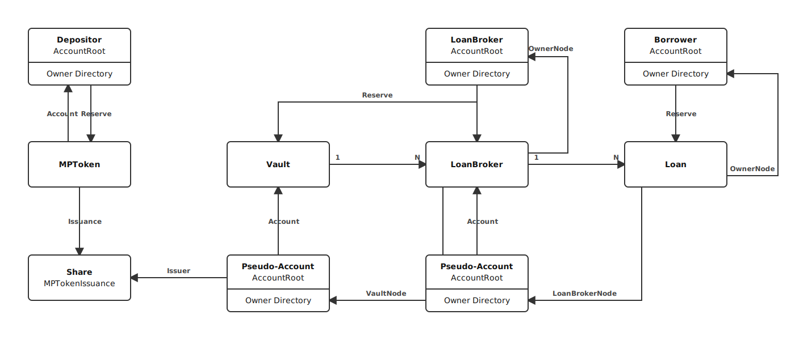

<pre>
  xls: 66
  title: Lending Protocol
  description: XRP Ledger-native protocol for issuing uncollateralized, fixed-term loans using pooled funds, enabling on-chain credit origination.
  implementation: https://github.com/XRPLF/rippled/pull/5270
  author: Vytautas Vito Tumas <vtumas@ripple.com>, Aanchal Malhotra <amalhotra@ripple.com>
  status: Draft
  category: Amendment
  requires: XLS-65, XLS-64
  created: 2024-10-18
  updated: 2026-01-14
  proposal-from: https://github.com/XRPLF/XRPL-Standards/discussions/190
</pre>

# Lending Protocol

## 1. Abstract

Decentralized Finance (DeFi) lending represents a transformative force within the blockchain ecosystem. It revolutionizes traditional financial services by offering a peer-to-peer alternative without intermediaries like banks or financial institutions. At its core, DeFi lending platforms empower users to borrow and lend digital assets directly, fostering financial inclusion, transparency, and efficiency.

This proposal introduces fundamental primitives for an XRP Ledger-native Lending Protocol. The protocol offers straightforward on-chain uncollateralized fixed-term loans, utilizing pooled funds with pre-set terms for interest-accruing loans. The design relies on off-chain underwriting and risk management to assess the creditworthiness of the borrowers. However, the First-Loss Capital protection scheme absorbs some of the losses in case of a Loan Default.

This version intentionally skips the complex mechanisms of automated on-chain collateral and liquidation management. Instead, it focuses on the primitives and the essential components for on-chain credit origination. Therefore, the primary design principle is flexibility and reusability to enable the introduction of additional complex features in the future.

## 2. Introduction

The Lending Protocol uses the [Vault](../XLS-0065-single-asset-vault/README.md) on-chain object to provision assets from one or more depositors. A Loan Broker is responsible for managing the Lending Protocol and the associated Vault. The Vault Owner and Loan Broker must be on the same account, but this may change in the future.

The specification introduces two new ledger entries: `LoanBroker` and `Loan`. The `LoanBroker` object captures the Lending Protocol-specific details, such as fees and First-Loss Capital cover. Furthermore, it tracks the funds taken from the `Vault`. The `Loan` object captures the Loan agreement between the Loan Broker and the Borrower.

The specification introduces the following transactions:

- **`LoanBrokerSet`**: A transaction to create a new `LoanBroker` object.
- **`LoanBrokerDelete`**: A transaction to delete an existing `LoanBroker` object.
- **`LoanBrokerCoverDeposit`**: A transaction to deposit First-Loss Capital.
- **`LoanBrokerCoverWithdraw`**: A transaction to withdraw First-Loss Capital.
- **`LoanBrokerCoverClawback`**: A transaction to clawback the First-Loss Capital. This transaction can only be submitted by the Issuer of the asset.
- **`LoanSet`**: A transaction to create a new `Loan` object.
- **`LoanDelete`**: A transaction to delete an existing `Loan` object.
- **`LoanManage`**: A transaction to manage an existing `Loan`.
- **`LoanPay`**: A transaction to make a `Loan` payment.

The flow of the lending protocol is as follows:

1. The Loan Broker creates a `Vault` ledger entry.
2. The Loan Broker creates a `LoanBroker` ledger entry with a `LoanBrokerSet` transaction.
3. The Depositors deposit assets into the `Vault`.
4. Optionally, the Loan Broker deposits First-Loss Capital into the `LoanBroker` with the `LoanBrokerCoverDeposit` transaction.
5. The Loan Broker and Borrower create a `Loan` object with a `LoanSet` transaction and the requested principal (excluding fees) is transered to the Borrower.
6. If the Borrower fails to pay the Loan, the Loan Broker can default the `Loan` using the `LoanManage` transaction.
7. Once the Loan has matured (or defaulted), the Borrower or the Loan Broker can delete it using a `LoanDelete` transaction.
8. Optionally, the Loan Broker can withdraw the First-Loss Capital using the `LoanBrokerCoverWithdraw` transaction.
9. When all `Loan` objects are deleted, the Loan Broker can delete the `LoanBroker` object with a `LoanBrokerDelete` transaction.
10. When all `LoanBroker` objects are deleted, the Loan Broker can delete the `Vault` object.

### 2.1 Compliance Features

### 2.1.1 Clawback

Clawback is a mechanism by which an asset Issuer (IOU or MPT, not XRP) claws back the funds. The Issuer may clawback funds from the First-Loss Capital.

### 2.1.2 Freeze

Freeze is a mechanism by which an asset Issuer (IOU or MPT, not XRP) freezes an `Account`, preventing that account from sending the Asset. Deep Freeze is a mechanism by which an asset Issuer prevents an `Account` from both sending and receiving an Asset. Finally, an Issuer may enact a global freeze, which prevents everyone from sending or receiving the Asset. Note that in both single-account and global freezes, the Asset can be sent to the Issuer.

If the Issuer freezes a Borrower's account, the Borrower cannot make loan payments. However, a frozen account does not lift the obligation to repay a Loan. If the Issuer Deep Freezes a Borrower's account, the Borrower cannot make loan payments.

A Deep Freeze does not affect the Loan Broker's functions. However, a Deep Freeze will prevent the Loan Broker from receiving any Lending Protocol Fees.

The Issuer may also Freeze or Deep Freeze the `_pseudo-account_` of the Loan Broker. A Freeze on the `_pseudo-account_` will prevent the Loan Broker from creating new Loans. However existing Loans will not be affected. In contrast, a Deep Freeze, will also prevent the Loans from being paid.

### 2.2 Risk Management

Risk management involves mechanisms that mitigate the risks associated with lending. To protect investors' assets, we have introduced an optional first-loss capital protection scheme. This scheme requires the Loan Broker to deposit a fund that can be partially liquidated to cover losses in the event of a loan default. The amount of first-loss capital required is a percentage of the total debt owed to the Vault. In case of a default, a portion of the first-loss capital will be liquidated based on the minimum required cover. The liquidated capital is placed back into the Vault to cover some of the loss.

### 2.3 Interest Rates

There are three basic interest rates associated with a Loan:

- **`Interest Rate`**: The regular interest rate based on the principal amount. It is the cost of borrowing funds.
- **`Late Interest Rate`**: A higher interest rate charged for a late payment.
- **`Full Payment Rate`**: An interest rate charged for repaying the total Loan early.

See [Appendix A-3](#a-3-loanpay-implementation-reference) for detailed formulas on how these rates are applied during payment processing.

### 2.4 Fees

The lending protocol charges a number of fees that the Loan Broker can configure. The protocol will not charge the fees if the Loan Broker has not deposited enough First-Loss Capital.

- **`Management Fee`**: This is a fee charged by the Loan Broker, calculated as a percentage of the interest earned on loans. It's deducted from the interest that would otherwise go to the Vault depositors. Essentially, borrowers pay the full interest, but before that interest reaches depositors, the Loan Broker takes their cut.
- **`Loan Origination Fee`**: A nominal fee paid to the Loan Broker taken from the principal lent.
- **`Loan Service Fee`**: A nominal fee paid on top of each loan payment.
- **`Late Payment Fee`**: A nominal fee paid on top of a late payment.
- **`Early Payment Fee`**: A nominal fee paid on top of an early payment.

### 2.5 Terminology

#### 2.5.1 Terms

- **`Fixed-Term Loan`**: A type of Loan with a known end date and a constant periodic payment schedule.
- **`Principal`**: The original sum of money borrowed that must be repaid, excluding interest or other fees.
- **`Interest`**: The cost of borrowing the Asset, calculated as a percentage of the loan principal, which the Borrower pays to the Lender over time.
- **`Default`**: The failure by the Borrower to meet the obligations of a loan, such as missing payments.
- **`First-Loss Capital`**: The portion of capital that absorbs initial losses in case of a Default, protecting the Vault from loss.
- **`Term`**: The period over which a Borrower must repay the Loan.
- **`Amortization`**: The gradual repayment of a loan through scheduled payments that cover both interest and principal over time. For the complete amortization formula and implementation details, see [Appendix A-3.1](#a-31-conceptual-loan-value).
- **`Repayment Schedule`**: A detailed plan that outlines when and how much a borrower must pay to repay the Loan funds.
- **`Grace Period`**: A set period after the Loan's due date after which the Loan Broker can default the Loan

#### 2.5.2 Actors

- **`LoanBroker`**: The entity issuing the Loan.
- **`Borrower`**: The account that is borrowing funds.

### 2.6 System Diagram



## 3. Specification

### 3.1. Ledger Entry: `LoanBroker`

The `LoanBroker` object captures attributes of the Lending Protocol.

#### 3.1.1 Object Identifier

The key of the `LoanBroker` object is the result of [`SHA512-Half`](https://xrpl.org/docs/references/protocol/data-types/basic-data-types/#hashes) of the following values concatenated in order:

- The `LoanBroker` space key `0x006C` (Lower-case `l`).
- The `AccountID`(<https://xrpl.org/docs/references/protocol/binary-format/#accountid-fields>) of the account submitting the `LoanBrokerSet` transaction, i.e. `Lender`.
- The transaction `Sequence` number. If the transaction used a [Ticket](https://xrpl.org/docs/concepts/accounts/tickets/), use the `TicketSequence` value.

#### 3.1.2 Fields

The `LoanBroker` object has the following fields:

| Field Name             | Constant | Required | JSON Type | Internal Type | Default Value | Description                                                                                                                                                                                                  |
| ---------------------- | :------: | :------: | :-------: | :-----------: | :-----------: | ------------------------------------------------------------------------------------------------------------------------------------------------------------------------------------------------------------ |
| `LedgerEntryType`      |   Yes    |   Yes    | `string`  |   `UINT16`    |   `0x0088`    | Ledger object type.                                                                                                                                                                                          |
| `LedgerIndex`          |   Yes    |   Yes    | `string`  |   `UINT16`    |     `N/A`     | Ledger object identifier.                                                                                                                                                                                    |
| `Flags`                |    No    |   Yes    | `number`  |   `UINT32`    |       0       | Ledger object flags.                                                                                                                                                                                         |
| `PreviousTxnID`        |    No    |   Yes    | `string`  |   `HASH256`   |     `N/A`     | The ID of the transaction that last modified this object.                                                                                                                                                    |
| `PreviousTxnLgrSeq`    |    No    |   Yes    | `number`  |   `UINT32`    |     `N/A`     | The sequence of the ledger containing the transaction that last modified this object.                                                                                                                        |
| `Sequence`             |   Yes    |   Yes    | `number`  |   `UINT32`    |     `N/A`     | The transaction sequence number that created the `LoanBroker`.                                                                                                                                               |
| `LoanSequence`         |    No    |   Yes    | `number`  |   `UINT32`    |       1       | A sequential identifier for Loan objects, incremented each time a new Loan is created by this LoanBroker instance.                                                                                           |
| `OwnerNode`            |   Yes    |   Yes    | `number`  |   `UINT64`    |     `N/A`     | Identifies the page where this item is referenced in the owner's directory.                                                                                                                                  |
| `VaultNode`            |   Yes    |   Yes    | `number`  |   `UINT64`    |     `N/A`     | Identifies the page where this item is referenced in the Vault's _pseudo-account_ owner's directory.                                                                                                         |
| `VaultID`              |   Yes    |   Yes    | `string`  |   `HASH256`   |     `N/A`     | The ID of the `Vault` object associated with this Lending Protocol Instance.                                                                                                                                 |
| `Account`              |   Yes    |   Yes    | `string`  |  `ACCOUNTID`  |     `N/A`     | The address of the `LoanBroker` _pseudo-account_.                                                                                                                                                            |
| `Owner`                |   Yes    |   Yes    | `string`  |  `ACCOUNTID`  |     `N/A`     | The address of the Loan Broker account.                                                                                                                                                                      |
| `Data`                 |    No    |    No    | `string`  |    `BLOB`     |     None      | Arbitrary metadata about the `LoanBroker`. Limited to 256 bytes.                                                                                                                                             |
| `ManagementFeeRate`    |   Yes    |    No    | `number`  |   `UINT16`    |       0       | The 1/10th basis point fee charged by the Lending Protocol. Valid values are between 0 and 10000 inclusive. A value of 1 is equivalent to 1/10 bps or 0.001%                                                 |
| `OwnerCount`           |    No    |   Yes    | `number`  |   `UINT32`    |       0       | The number of active Loans issued by the `LoanBroker`.                                                                                                                                                       |
| `DebtTotal`            |    No    |   Yes    | `string`  |   `NUMBER`    |       0       | The total asset amount the protocol owes the Vault, including interest.                                                                                                                                      |
| `DebtMaximum`          |    No    |   Yes    | `string`  |   `NUMBER`    |       0       | The maximum amount the protocol can owe the Vault. The default value of 0 means there is no limit to the debt.                                                                                               |
| `CoverAvailable`       |    No    |   Yes    | `string`  |   `NUMBER`    |       0       | The total amount of first-loss capital deposited into the Lending Protocol.                                                                                                                                  |
| `CoverRateMinimum`     |    No    |   Yes    | `number`  |   `UINT32`    |       0       | The 1/10th basis point of the `DebtTotal` that the first-loss capital must cover. Valid values are between 0 and 100000 inclusive. A value of 1 is equivalent to 1/10 bps or 0.001%.                         |
| `CoverRateLiquidation` |    No    |   Yes    | `number`  |   `UINT32`    |       0       | The 1/10th basis point of minimum required first-loss capital that is liquidated to cover a Loan default. Valid values are between 0 and 100000 inclusive. A value of 1 is equivalent to 1/10 bps or 0.001%. |

#### 3.1.3 Ownership

The lending protocol object is stored in the ledger and tracked in an [Owner Directory](https://xrpl.org/docs/references/protocol/ledger-data/ledger-entry-types/directorynode) owned by the account submitting the `LoanBrokerSet` transaction. Furthermore, the object is also tracked in the `OwnerDirectory` of the `Vault` _`pseudo-account`_. The `_pseudo_account_` `OwnerDirectory` page is captured by the `VaultNode` field.

The `RootIndex` of the `DirectoryNode` object is the result of [`SHA512-Half`](https://xrpl.org/docs/references/protocol/data-types/basic-data-types/#hashes) of the following values concatenated in order:

- The `OwnerDirectory` space key `0x004F`
- The `LoanBrokerID`

#### 3.1.4 Reserves

The `LoanBroker` object costs two owner reserve for the account creating it.

#### 3.1.5 Deletion

- All Loans associated with the LoanBroker must be deleted first.
- The LoanBroker must have no outstanding debt owed to the Vault.
- Any remaining First-Loss Capital is automatically transferred back to the broker owner upon deletion. The deletion will fail if the broker owner is deep frozen for the asset, preventing the return of funds.

**Account Deletion Blocker:** Yes. This object must be deleted before its owner account can be deleted.

#### 3.1.6 Pseudo-Account

The `LoanBroker` object _pseudo-account_ holds the First-Loss Capital deposited by the LoanBroker. The _pseudo-account_ follows the XLS-64d specification for pseudo accounts. The `AccountRoot` object is created when creating the `Vault` object.

#### 3.1.7 Freeze/Lock

The `LoanBroker` _pseudo-account_ can be frozen or locked by the asset Issuer. The effects depend on the freeze level:

**Freeze on the _pseudo-account_:**

- Prevents the LoanBroker from creating new Loans (`LoanSet` fails), because the Vault _pseudo-account_ cannot transfer funds through a frozen intermediary.
- Prevents withdrawing First-Loss Capital (`LoanBrokerCoverWithdraw` fails).
- Does **not** prevent existing Loans from being paid. Borrower payments flow directly to the Vault _pseudo-account_ and do not require the LoanBroker _pseudo-account_ to send funds.
- Does **not** prevent depositing additional First-Loss Capital (`LoanBrokerCoverDeposit` succeeds as long as the _pseudo-account_ is not deep frozen).

**Deep Freeze on the _pseudo-account_:**

- All effects of a regular freeze, plus:
- Prevents Loan payments (`LoanPay` fails), because payments cannot be received by the deep-frozen _pseudo-account_ for fee routing.
  - A Deep Freeze does not affect Loan payment schedule.
- Prevents depositing First-Loss Capital (`LoanBrokerCoverDeposit` fails), because the _pseudo-account_ cannot receive funds.

**Deep Freeze on the LoanBroker Owner:**

- Prevents the LoanBroker owner from receiving fees directly. When the owner is deep frozen, fees are redirected to the LoanBroker _pseudo-account_'s First-Loss Capital pool instead.
- Prevents creating new Loans (`LoanSet` fails).
- Prevents deleting the LoanBroker (`LoanBrokerDelete` fails) if First-Loss Capital remains, because the capital cannot be returned to a deep-frozen owner.

**Global Freeze:**

- Prevents all Loan creation, Loan payments, and First-Loss Capital deposits/withdrawals for the affected asset.

#### 3.1.8 Invariants

_TBD_

#### 3.1.9 Example JSON

```json
{
  "LedgerEntryType": "LoanBroker",
  "Flags": 0,
  "PreviousTxnID": "6FCDB5135BBEA61BC2A2B07013CB9EB3015684D4536195A85D847370DECF8D0A",
  "PreviousTxnLgrSeq": 3964034,
  "Sequence": 3964022,
  "LoanSequence": 2,
  "OwnerNode": "0",
  "VaultNode": "0",
  "VaultID": "4AF1FD30BFAB1CDF10CF6783B37BA96873CBB7C4CE5DDFC89D9B8DB50BD29F54",
  "Account": "rhYWLRMWzrdSM5U2jPArbpH8kPuyVuWze4",
  "Owner": "rDNs1puRWQh4ezekGfVmtoEHAJ6fWbqCEA",
  "OwnerCount": 1,
  "DebtTotal": "1000.003710049006",
  "CoverAvailable": "500",
  "index": "18D3057DC8297940B1790354455A9108BA15760B3FBD85748137751FB781C311"
}
```

#### 3.1.10 Accounting

The Lending Protocol tracks the funds owed to the associated Vault in the `DebtTotal` attribute. It captures the principal amount taken from the Vault and the interest due, excluding all fees. The `DebtMaximum` attribute controls the maximum debt a Lending Protocol may incur. Whenever the Lender issues a Loan, `DebtTotal` is incremented by the Loan principal and interest, excluding fees. When $DebtTotal \geq DebtMaximum$, the Lender cannot issue new loans until some of the debt is cleared. Furthermore, the Lender may not issue a loan that would cause the `DebtTotal` to exceed `DebtMaximum`.

**Examples**

**Example 1: Issuing a Loan**

_Initial States_

Vault:

- AssetsTotal = 100,000 Tokens
- AssetsAvailable = 100,000 Tokens
- SharesTotal = 100,000 Shares

Lending Protocol:

- DebtTotal = 0
- ManagementFeeRate = 0.1 (10%) — the fee charged against any interest

Loan (issued by the Lender):

- PrincipalRequested = 1,000 Tokens
- InterestRate = 0.1 (10%)
- TotalInterestOutstanding = PrincipalRequested × InterestRate = 100 Tokens _(simplified)_

_State Changes_

Vault:

- AssetsTotal = AssetsTotal + (TotalInterestOutstanding − (TotalInterestOutstanding × ManagementFeeRate))
  = 100,000 + (100 − (100 × 0.1)) = 100,000 + 90 = **100,090 Tokens**
- AssetsAvailable = AssetsAvailable − PrincipalRequested
  = 100,000 − 1,000 = **99,000 Tokens**
- SharesTotal = (UNCHANGED)

Lending Protocol:

- DebtTotal = DebtTotal + PrincipalRequested + (TotalInterestOutstanding − (TotalInterestOutstanding × ManagementFeeRate))
  = 0 + 1,000 + (100 − (100 × 0.1)) = 1,000 + 90 = **1,090 Tokens**

---

**Example 2: Loan Payment**

_Initial States_

Vault:

- AssetsTotal = 100,090 Tokens
- AssetsAvailable = 99,000 Tokens
- SharesTotal = 100,000 Shares

Lending Protocol:

- DebtTotal = 1,090 Tokens
- ManagementFeeRate = 0.1 (10%) — the fee charged against any interest

Loan:

- PrincipalRequested = 1,000 Tokens
- InterestRate = 0.1 (10%)
- PaymentRemaining = 2 _(simplified)_
- TotalInterestOutstanding = PrincipalRequested × InterestRate = 100 Tokens _(simplified)_

The Borrower makes a single payment:

- PaymentAmount = 550 Tokens
- PaymentPrincipalPortion = 500 Tokens
- PaymentInterestPortion = 50 Tokens

_State Changes_

Vault:

- AssetsTotal = (UNCHANGED)
- AssetsAvailable = AssetsAvailable + PaymentPrincipalPortion + (PaymentInterestPortion − (PaymentInterestPortion × ManagementFeeRate))
  = 99,000 + 500 + (50 − (50 × 0.1)) = **99,545 Tokens**
- SharesTotal = (UNCHANGED)

Lending Protocol:

- DebtTotal = DebtTotal − PaymentPrincipalPortion − (PaymentInterestPortion − (PaymentInterestPortion × ManagementFeeRate))
  = 1,090 − 500 − (50 − (50 × 0.1)) = **545 Tokens**

#### 3.1.11 First-Loss Capital

The First-Loss Capital is an optional mechanism to protect the Vault depositors from incurring a loss in case of a Loan default by absorbing some of the loss. The following parameters control this mechanism:

- `CoverAvailable` - the total amount of cover deposited by the Lending Protocol Owner.
- `CoverRateMinimum` - the percentage of `DebtTotal` that must be covered by the `CoverAvailable`.
- `CoverRateLiquidation` - the maximum percentage of the minimum required cover ($DebtTotal \times CoverRateMinimum$) that will be liquidated to cover a Loan Default.

Whenever the available cover falls below the minimum cover required, two consequences occur:

- The Lender cannot issue new Loans.
- The Lender cannot directly receive fees. The fees are instead added to the First-Loss Capital to cover the deficit.

**Examples**

**Example 1: Loan Default**

_Initial States_

Vault:

- AssetsTotal = 100,090 Tokens
- AssetsAvailable = 99,000 Tokens
- SharesTotal = 100,000 Tokens

Lending Protocol:

- DebtTotal = 1,090 Tokens
- CoverRateMinimum = 0.1 (10%)
- CoverRateLiquidation = 0.1 (10%)
- CoverAvailable = 1,000 Tokens

Loan:

- PrincipleOutstanding = 1,000 Tokens
- InterestOutstanding = 90 Tokens

_First-Loss Capital liquidation_

- DefaultAmount = PrincipleOutstanding + InterestOutstanding
  = 1,000 + 90 = 1,090 Tokens
- DefaultCovered = min((DebtTotal × CoverRateMinimum) × CoverRateLiquidation, DefaultAmount)
  = min((1,090 × 0.1) × 0.1, 1,090) = min(10.9, 1,090) = **10.9 Tokens**
- Loss = DefaultAmount − DefaultCovered
  = 1,090 − 10.9 = **1,079.1 Tokens**
- FundsReturned = DefaultCovered = **10.9 Tokens**

> Note: Loss + FundsReturned must equal PrincipleOutstanding + InterestOutstanding.

_State Changes_

Vault:

- AssetsTotal = AssetsTotal − Loss
  = 100,090 − 1,079.1 = **99,010.9 Tokens**
- AssetsAvailable = AssetsAvailable + FundsReturned
  = 99,000 + 10.9 = **99,010.9 Tokens**
- SharesTotal = (UNCHANGED)

Lending Protocol:

- DebtTotal = DebtTotal − (PrincipleOutstanding + InterestOutstanding)
  = 1,090 − (1,000 + 90) = **0 Tokens**
- CoverAvailable = CoverAvailable − DefaultCovered
  = 1,000 − 10.9 = **989.1 Tokens**

### 3.2. Ledger Entry: `Loan`

A Loan ledger entry captures various Loan terms on-chain. It is an agreement between the Borrower and the loan issuer.

#### 3.2.1 Object Identifier

The `LoanID` is calculated as follows:

- Calculate [`SHA512-Half`](https://xrpl.org/docs/references/protocol/data-types/basic-data-types/#hashes) of the following values:
  - The `Loan` space key `0x004C` (capital L)
  - The `LoanBrokerID` of the associated `LoanBroker` object.
  - The `LoanSequence` of the `LoanBroker` object.

#### 3.2.2 Fields

| Field Name                 | Constant | Required | JSON Type | Internal Type |                                   Default Value                                   | Description                                                                                                                                                           |
| -------------------------- | :------: | :------: | :-------: | :-----------: | :-------------------------------------------------------------------------------: | --------------------------------------------------------------------------------------------------------------------------------------------------------------------- |
| `LedgerEntryType`          |   Yes    |   Yes    | `string`  |   `UINT16`    |                                     `0x0089`                                      | Ledger object type.                                                                                                                                                   |
| `LedgerIndex`              |   Yes    |   Yes    | `string`  |   `UINT16`    |                                       `N/A`                                       | Ledger object identifier.                                                                                                                                             |
| `Flags`                    |    No    |    No    | `number`  |   `UINT32`    |                                         0                                         | Ledger object flags.                                                                                                                                                  |
| `PreviousTxnID`            |    No    |   Yes    | `string`  |   `HASH256`   |                                       `N/A`                                       | The ID of the transaction that last modified this object.                                                                                                             |
| `PreviousTxnLgrSeq`        |    No    |   Yes    | `number`  |   `UINT32`    |                                       `N/A`                                       | The ledger sequence containing the transaction that last modified this object.                                                                                        |
| `LoanSequence`             |   Yes    |   Yes    | `number`  |   `UINT32`    |                                       `N/A`                                       | The sequence number of the Loan.                                                                                                                                      |
| `OwnerNode`                |   Yes    |   Yes    | `number`  |   `UINT64`    |                                       `N/A`                                       | Identifies the page where this item is referenced in the `Borrower` owner's directory.                                                                                |
| `LoanBrokerNode`           |   Yes    |   Yes    | `number`  |   `UINT64`    |                                       `N/A`                                       | Identifies the page where this item is referenced in the `LoanBroker`s owner directory.                                                                               |
| `LoanBrokerID`             |   Yes    |   Yes    | `string`  |   `HASH256`   |                                       `N/A`                                       | The ID of the `LoanBroker` associated with this Loan Instance.                                                                                                        |
| `Borrower`                 |   Yes    |   Yes    | `string`  |  `ACCOUNTID`  |                                       `N/A`                                       | The address of the account that is the borrower.                                                                                                                      |
| `LoanOriginationFee`       |   Yes    |   Yes    | `string`  |   `NUMBER`    |                                       `N/A`                                       | A nominal funds amount paid to the `LoanBroker.Owner` when the Loan is created.                                                                                       |
| `LoanServiceFee`           |   Yes    |   Yes    | `string`  |   `NUMBER`    |                                       `N/A`                                       | A nominal funds amount paid to the `LoanBroker.Owner` with every Loan payment.                                                                                        |
| `LatePaymentFee`           |   Yes    |   Yes    | `string`  |   `NUMBER`    |                                       `N/A`                                       | A nominal funds amount paid to the `LoanBroker.Owner` when a payment is late.                                                                                         |
| `ClosePaymentFee`          |   Yes    |   Yes    | `string`  |   `NUMBER`    |                                       `N/A`                                       | A nominal funds amount paid to the `LoanBroker.Owner` when a full payment is made.                                                                                    |
| `OverpaymentFee`           |   Yes    |   Yes    | `number`  |   `UINT32`    |                                       `N/A`                                       | A fee charged on overpayments in 1/10th basis points. Valid values are between 0 and 100000 inclusive. (0 - 100%)                                                     |
| `InterestRate`             |   Yes    |   Yes    | `number`  |   `UINT32`    |                                       `N/A`                                       | Annualized interest rate of the Loan in 1/10th basis points.                                                                                                          |
| `LateInterestRate`         |   Yes    |   Yes    | `number`  |   `UINT32`    |                                       `N/A`                                       | A premium is added to the interest rate for late payments in 1/10th basis points. Valid values are between 0 and 100000 inclusive. (0 - 100%)                         |
| `CloseInterestRate`        |   Yes    |   Yes    | `number`  |   `UINT32`    |                                       `N/A`                                       | An interest rate charged for repaying the Loan early in 1/10th basis points. Valid values are between 0 and 100000 inclusive. (0 - 100%)                              |
| `OverpaymentInterestRate`  |   Yes    |   Yes    | `number`  |   `UINT32`    |                                       `N/A`                                       | An interest rate charged on overpayments in 1/10th basis points. Valid values are between 0 and 100000 inclusive. (0 - 100%)                                          |
| `StartDate`                |   Yes    |   Yes    | `number`  |   `UINT32`    |                             `CurrentLedgerTimestamp`                              | The timestamp of when the Loan started [Ripple Epoch](https://xrpl.org/docs/references/protocol/data-types/basic-data-types/#specifying-time).                        |
| `PaymentInterval`          |   Yes    |   Yes    | `number`  |   `UINT32`    |                                       `N/A`                                       | Number of seconds between Loan payments.                                                                                                                              |
| `GracePeriod`              |   Yes    |   Yes    | `number`  |   `UINT32`    |                                       `N/A`                                       | The number of seconds after the Loan's Payment Due Date that the Loan can be Defaulted.                                                                               |
| `PreviousPaymentDueDate`   |    No    |   Yes    | `number`  |   `UINT32`    |                                        `0`                                        | The timestamp of when the previous payment was made in [Ripple Epoch](https://xrpl.org/docs/references/protocol/data-types/basic-data-types/#specifying-time).        |
| `NextPaymentDueDate`       |    No    |   Yes    | `number`  |   `UINT32`    |                   `LoanSet.StartDate + LoanSet.PaymentInterval`                   | The timestamp of when the next payment is due in [Ripple Epoch](https://xrpl.org/docs/references/protocol/data-types/basic-data-types/#specifying-time).              |
| `PaymentRemaining`         |    No    |   Yes    | `number`  |   `UINT32`    |                              `LoanSet.PaymentTotal`                               | The number of payments remaining on the Loan.                                                                                                                         |
| `TotalValueOutstanding`    |    No    |   Yes    | `string`  |   `NUMBER`    |                             `TotalValueOutstanding()`                             | The total outstanding value of the Loan, including all fees and interest.                                                                                             |
| `PrincipalOutstanding`     |    No    |   Yes    | `string`  |   `NUMBER`    |                           `LoanSet.PrincipalRequested`                            | The principal amount that the Borrower still owes.                                                                                                                    |
| `ManagementFeeOutstanding` |    No    |   Yes    | `string`  |   `NUMBER`    | `(TotalValueOutstanding() - PrincipalOutstanding) x LoanBroker.ManagementFeeRate` | The remaining Management Fee owed to the LoanBroker.                                                                                                                  |
| `PeriodicPayment`          |    No    |   Yes    | `string`  |   `NUMBER`    |                              `LoanPeriodicPayment()`                              | The calculated periodic payment amount for each payment interval.                                                                                                     |
| `LoanScale`                |   Yes    |    No    | `number`  |    `INT32`    |                                `LoanTotalValue()`                                 | The scale factor that ensures all computed amounts are rounded to the same number of decimal places. It is determined based on the total loan value at creation time. |

##### 3.2.2.1 `TotalValueOutstanding`

The total outstanding value of the Loan, including management fee charged against the interest.

##### 3.2.2.2 `PrincipalOutstanding`

The principal amount that the Borrower still owes. This amount decreases each time the borrower makes a successful loan payment. This field ensures that the loan is fully settled on the final payment.

##### 3.2.2.3 `ManagementFeeOutstanding`

The remaining Management Fee owed to the LoanBroker. This amount decreases each time the borrower makes a successful loan payment. This field ensures that the loan is fully settled on the final payment.

##### 3.2.2.4 `TotalInterestOutstanding`

TotalInterestOutstanding represents the interest amount due from the Borrower. This value is not stored explicitly but is derived using the following formula: `TotalInterestOutstanding = TotalValueOutstanding - PrincipalOutstanding - ManagementFeeOutstanding`.

##### 3.2.2.5 `PeriodicPayment`

The periodic payment amount represents the precise sum the Borrower must pay during each payment cycle. For practical implementation, this value should be rounded UP when processing payments. The system automatically recalculates the PeriodicPayment following any overpayment by the borrower. For instance, when dealing with MPT loans, the calculated `PeriodicPayment` may be `10.251`. However, since MPTs only support whole number representations, the borrower would need to pay `11` units. The system maintains the precise periodic payment value at maximum accuracy since it is frequently referenced throughout loan payment computations.

#### 3.2.3 Flags

The `Loan` object supports the following flags:

| Flag Name            |  Flag Value  | Modifiable? |                      Description                       |
| -------------------- | :----------: | :---------: | :----------------------------------------------------: |
| `lsfLoanDefault`     | `0x00010000` |    `No`     |     If set, indicates that the Loan is defaulted.      |
| `lsfLoanImpaired`    | `0x00020000` |    `Yes`    |      If set, indicates that the Loan is impaired.      |
| `lsfLoanOverpayment` | `0x00040000` |    `No`     | If set, indicates that the Loan supports overpayments. |

#### 3.2.4 Ownership

The `Loan` objects are stored in the ledger and tracked in two [Owner Directories](https://xrpl.org/docs/references/protocol/ledger-data/ledger-entry-types/directorynode).

- The `OwnerNode` is the `Owner Directory` of the `Borrower` who is the main `Owner` of the `Loan` object, and therefore is responsible for the owner reserve.
- The `LoanBrokerNode` is the `Owner Directory` for the `LoanBroker` _pseudo-account_ to track all loans associated with the same `LoanBroker` object.

#### 3.2.5 Reserves

The `Loan` object costs one owner reserve for the `Borrower`.

#### 3.2.6 Deletion

- The Loan must be fully paid or defaulted. A Loan with remaining payments cannot be deleted.
- Either the Borrower or the LoanBroker owner may submit the deletion.

**Account Deletion Blocker:** Yes. This object must be deleted before the Borrower's account can be deleted.

#### 3.2.7 Invariants

_TBD_

#### 3.2.8 Example JSON

```json
{
  "LedgerEntryType": "Loan",
  "Flags": 0,
  "PreviousTxnID": "6FCDB5135BBEA61BC2A2B07013CB9EB3015684D4536195A85D847370DECF8D0A",
  "PreviousTxnLgrSeq": 3964034,
  "LoanSequence": 1,
  "OwnerNode": "0",
  "LoanBrokerNode": "0",
  "LoanBrokerID": "18D3057DC8297940B1790354455A9108BA15760B3FBD85748137751FB781C311",
  "Borrower": "rEjXbJh2hwn2SVME1EvdCiH6TnU5TEpvf",
  "InterestRate": 500,
  "StartDate": 825161902,
  "PaymentInterval": 3600,
  "GracePeriod": 60,
  "NextPaymentDueDate": 825165502,
  "PaymentRemaining": 12,
  "TotalValueOutstanding": "1000.003710049006",
  "PrincipalOutstanding": "1000",
  "PeriodicPayment": "83.33364250408379297",
  "LoanScale": -12,
  "index": "A85F331533BFD21557C30F92DC3432BDEBEC85436A937C41FFCBB21EA9C07AED"
}
```

#### 3.2.9 Loan Total Value

The loan's financial state is tracked through three key components:

- **PrincipalOutstanding**: Represents the remaining principal balance that the borrower must repay to satisfy the original loan amount.
- **TotalValueOutstanding**: Encompasses the complete remaining loan obligation, comprising the outstanding principal, all scheduled interest payments based on the original amortization schedule and the management fee paid on the interest. This value excludes any additional interest charges resulting from late payments, overpayments of full payments.
- **InterestOutstanding**: The total scheduled interest (including fee) remaining on the loan, derived as `TotalValueOutstanding - PrincipalOutstanding`.

**Asset-Specific Precision Handling**: Different asset types on the XRP Ledger have varying levels of precision that directly impact loan value calculations:

- **XRP (Drops)**: Only supports whole number values (1 drop = 0.000001 XRP)
- **MPTs (Multi-Purpose Tokens)**: Only support whole number values
- **IOUs**: Support up to 16 significant decimal digits

For loans denominated in discrete asset types (XRP drops and MPTs), all monetary values must be rounded to whole numbers. This rounding requirement means that:

1. **`TotalValueOutstanding`** is always rounded **up** to the nearest precision unit of an asset. This ensures the borrower pays at least the full theoretical value, preventing the loan from becoming underfunded due to rounding losses.

2. **`PrincipalOutstanding`** and **`ManagementFeeOutstanding`** are rounded to the nearest even number after each payment to avoid over-deducting from the borrower.

3. Due to the cumulative effect of rounding across multiple payment cycles, these on-ledger values may deviate by up to one asset unit from their theoretical mathematical values at any given time.

**Important**: Implementations must **not** recalculate these values from the theoretical formulas during payment processing. The stored ledger values are the authoritative source of truth. The pseudo-code in [Appendix A-3](#a-3-loanpay-implementation-reference) demonstrates how to properly handle these rounding discrepancies while maintaining loan integrity.

**Late Payment Interest Treatment**: Late payment penalties and additional interest charges are calculated and collected separately from the core loan value. These charges do not modify the `TotalValueOutstanding` calculation, which remains anchored to the original scheduled payment terms.

#### 3.2.10 Impairment

When the Loan Broker discovers that the Borower cannot make an upcoming payment, impairment allows the Loan Broker to register a "paper loss" with the Vault. The impairment mechanism moves the Next Payment Due Date to the time the Loan was impaired, allowing to default the Loan more quickly. However, if the Borrower makes a payment, the impairment status is automatically cleared.

### 3.3. Transaction: `LoanBrokerSet`

The transaction creates a new `LoanBroker` object or updates an existing one.

#### 3.3.1 Fields

| Field Name             | Required | JSON Type | Internal Type | Default Value | Description                                                                                                                                        |
| ---------------------- | :------: | :-------: | :-----------: | :-----------: | :------------------------------------------------------------------------------------------------------------------------------------------------- |
| `TransactionType`      |   Yes    | `string`  |   `UINT16`    |     `74`      | The transaction type.                                                                                                                              |
| `VaultID`              |   Yes    | `string`  |   `HASH256`   |     `N/A`     | The Vault ID that the Lending Protocol will use to access liquidity.                                                                               |
| `LoanBrokerID`         |    No    | `string`  |   `HASH256`   |     `N/A`     | The Loan Broker ID that the transaction is modifying.                                                                                              |
| `Flags`                |    No    | `number`  |   `UINT32`    |       0       | Specifies the flags for the LoanBroker.                                                                                                            |
| `Data`                 |    No    | `string`  |    `BLOB`     |     None      | Arbitrary metadata in hex format. The field is limited to 256 bytes.                                                                               |
| `ManagementFeeRate`    |    No    | `number`  |   `UINT16`    |       0       | The 1/10th basis point fee charged by the Lending Protocol Owner. Valid values are between 0 and 10000 inclusive (1% - 10%).                       |
| `DebtMaximum`          |    No    | `string`  |   `NUMBER`    |       0       | The maximum amount the protocol can owe the Vault. The default value of 0 means there is no limit to the debt. Must not be negative.               |
| `CoverRateMinimum`     |    No    | `number`  |   `UINT32`    |       0       | The 1/10th basis point `DebtTotal` that the first-loss capital must cover. Valid values are between 0 and 100000 inclusive.                        |
| `CoverRateLiquidation` |    No    | `number`  |   `UINT32`    |       0       | The 1/10th basis point of minimum required first-loss capital liquidated to cover a Loan default. Valid values are between 0 and 100000 inclusive. |

#### 3.3.2 Transaction Fee

This transaction uses the standard transaction fee.

#### 3.3.3 Failure Conditions

##### 3.3.3.1 Data Verification

1. `VaultID` is zero. (`temINVALID`)
2. `Data` field is present, non-empty, and exceeds 256 bytes. (`temINVALID`)
3. `ManagementFeeRate` is outside valid range (0 to 10000). (`temINVALID`)
4. `CoverRateMinimum` is outside valid range (0 to 100000). (`temINVALID`)
5. `CoverRateLiquidation` is outside valid range (0 to 100000). (`temINVALID`)
6. `DebtMaximum` is negative or exceeds maximum allowed value. (`temINVALID`)
7. One of `CoverRateMinimum` and `CoverRateLiquidation` is zero, and the other one is not. (Either both are zero, or both are non-zero) (`temINVALID`)
8. `LoanBrokerID` is specified and is zero. (`temINVALID`)
9. `LoanBrokerID` is specified and the submitter is attempting to modify fixed fields (`ManagementFeeRate`, `CoverRateMinimum`, `CoverRateLiquidation`). (`temINVALID`)

##### 3.3.3.2 Protocol-Level Failures

**If `LoanBrokerID` is not specified (creating new):**

1. `Vault` object with the specified `VaultID` does not exist on the ledger. (`tecNO_ENTRY`)
2. The submitter `AccountRoot.Account != Vault(VaultID).Owner`. (`tecNO_PERMISSION`)
3. Cannot add asset holding for the `Vault.Asset` (e.g., MPToken or TrustLine issues). (`tecNO_PERMISSION`)
4. The Vault _pseudo-account_ is frozen for the `Vault.Asset`. (`tecFROZEN` for IOUs, `tecLOCKED` for MPTs)
5. The submitter does not have sufficient reserve for the `LoanBroker` object and _pseudo-account_ (requires 2 owner reserves). (`tecINSUFFICIENT_RESERVE`)

**If `LoanBrokerID` is specified (modifying existing):**

6. `LoanBroker` object with the specified `LoanBrokerID` does not exist on the ledger. (`tecNO_ENTRY`)
7. The submitter `AccountRoot.Account != LoanBroker(LoanBrokerID).Owner`. (`tecNO_PERMISSION`)
8. The transaction `VaultID` does not match `LoanBroker(LoanBrokerID).VaultID`. (`tecNO_PERMISSION`)
9. `DebtMaximum` is being reduced to a non-zero value below the current `DebtTotal`. (`tecLIMIT_EXCEEDED`)

**Precision Validation:**

10. Any value field (e.g., `DebtMaximum`) cannot be represented in the `Vault.Asset` type without precision loss (relevant for XRP and MPT). (`tecPRECISION_LOSS`)

#### 3.3.4 State Changes

**If `LoanBrokerID` is not specified (creating new):**

1. Create `LoanBroker` ledger object.

2. Create pseudo-account `AccountRoot` for the `LoanBroker`:
   - Set `AccountRoot.LoanBrokerID` to the new `LoanBrokerID`.

3. Add asset holding for the `pseudo-account`:
   - If the `Vault(VaultID).Asset` is an `IOU`:
     - Create a `RippleState` object between the `Issuer` and the `LoanBroker` _pseudo-account_.
   - If the `Vault(VaultID).Asset` is an `MPT`:
     - Create an `MPToken` object for the `LoanBroker` _pseudo-account_.

4. Directory linking:
   - Add `LoanBrokerID` to the `OwnerDirectory` of the submitting account (sets `OwnerNode`).
   - Add `LoanBrokerID` to the `OwnerDirectory` of the Vault's _pseudo-account_ (sets `VaultNode`).

5. Update submitting account:
   - Increment the submitting account's `OwnerCount` by 2 (one for the `LoanBroker` object, one for the _pseudo-account_).

**If `LoanBrokerID` is specified (modifying existing):**

6. Update `LoanBroker.Data` if provided in the transaction.
7. Update `LoanBroker.DebtMaximum` if provided in the transaction.

#### 3.3.5 Invariants

**TBD**

#### 3.3.6 Example JSON

```json
{
  "TransactionType": "LoanBrokerSet",
  "Account": "rDNs1puRWQh4ezekGfVmtoEHAJ6fWbqCEA",
  "VaultID": "4AF1FD30BFAB1CDF10CF6783B37BA96873CBB7C4CE5DDFC89D9B8DB50BD29F54",
  "Flags": 0,
  "Data": "48656C6C6F20576F726C64",
  "ManagementFeeRate": 0,
  "DebtMaximum": "0",
  "CoverRateMinimum": 0,
  "CoverRateLiquidation": 0,
  "Fee": "1",
  "Sequence": 3964022
}
```

### 3.4. Transaction: `LoanBrokerDelete`

#### 3.4.1 Fields

| Field Name        | Required | JSON Type | Internal Type | Default Value | Description                                          |
| ----------------- | :------: | :-------: | :-----------: | :-----------: | :--------------------------------------------------- |
| `TransactionType` |   Yes    | `string`  |   `UINT16`    |     `75`      | The transaction type.                                |
| `LoanBrokerID`    |   Yes    | `string`  |   `HASH256`   |     `N/A`     | The Loan Broker ID that the transaction is deleting. |

#### 3.4.2 Transaction Fee

This transaction uses the standard transaction fee.

#### 3.4.3 Failure Conditions

##### 3.4.3.1 Data Verification

1. `LoanBrokerID` is zero. (`temINVALID`)

##### 3.4.3.2 Protocol-Level Failures

1. `LoanBroker` object with the specified `LoanBrokerID` does not exist on the ledger. (`tecNO_ENTRY`)
2. The submitter `AccountRoot.Account != LoanBroker(LoanBrokerID).Owner`. (`tecNO_PERMISSION`)
3. `LoanBroker.OwnerCount != 0` (has outstanding loans). (`tecHAS_OBLIGATIONS`)
4. `LoanBroker.DebtTotal` rounds to non-zero after scaling (defensive check—should have been cleared by last `LoanDelete`). (`tecHAS_OBLIGATIONS`)
5. `LoanBroker.CoverAvailable > 0` and the broker owner is deep frozen for the `Vault.Asset`. (`tecFROZEN` for IOUs, `tecLOCKED` for MPTs)

#### 3.4.4 State Changes

1. Remove `LoanBrokerID` from the `OwnerDirectory` of the submitting account (using `OwnerNode`).
2. Remove `LoanBrokerID` from the `OwnerDirectory` of the Vault's _pseudo-account_ (using `VaultNode`).
3. Transfer `LoanBroker.CoverAvailable` from the broker _pseudo-account_ to the submitting account (transfer fee waived):
   - If `Vault.Asset` is `XRP`:
     - Decrease the `Balance` field of the `LoanBroker` _pseudo-account_ `AccountRoot` by `CoverAvailable`.
     - Increase the `Balance` field of the submitting account `AccountRoot` by `CoverAvailable`.
   - If `Vault.Asset` is an `IOU`:
     - Decrease the `RippleState` balance between the `LoanBroker` _pseudo-account_ and the `Issuer` by `CoverAvailable`.
     - Increase the `RippleState` balance between the submitting account and the `Issuer` by `CoverAvailable`.
   - If `Vault.Asset` is an `MPT`:
     - Decrease the `MPToken.MPTAmount` of the `LoanBroker` _pseudo-account_ `MPToken` object by `CoverAvailable`.
     - Increase the `MPToken.MPTAmount` of the submitting account `MPToken` object by `CoverAvailable`.
4. Remove the empty asset holding from the broker _pseudo-account_:
   - If `Vault.Asset` is an `IOU`: Delete the `RippleState` object between the broker _pseudo-account_ and the `Issuer`.
   - If `Vault.Asset` is an `MPT`: Delete the `MPToken` object for the broker _pseudo-account_.
5. Delete the `LoanBroker` _pseudo-account_ `AccountRoot` object.
6. Delete the `LoanBroker` ledger object.
7. Decrement the submitting account's `OwnerCount` by 2 (one for the `LoanBroker` object, one for the _pseudo-account_).

#### 3.4.5 Invariants

- If `LoanBroker.OwnerCount = 0` the `DirectoryNode` will have at most one node (the root), which will only hold entries for `RippleState` or `MPToken` objects.

#### 3.4.6 Example JSON

```json
{
  "TransactionType": "LoanBrokerDelete",
  "Account": "rDNs1puRWQh4ezekGfVmtoEHAJ6fWbqCEA",
  "LoanBrokerID": "18D3057DC8297940B1790354455A9108BA15760B3FBD85748137751FB781C311",
  "Fee": "1",
  "Sequence": 3964023
}
```

### 3.5. Transaction: `LoanBrokerCoverDeposit`

The transaction deposits First-Loss Capital into the `LoanBroker` object.

#### 3.5.1 Fields

| Field Name        | Required |      JSON Type       | Internal Type | Default Value | Description                                                |
| ----------------- | :------: | :------------------: | :-----------: | :-----------: | :--------------------------------------------------------- |
| `TransactionType` |   Yes    |       `string`       |   `UINT16`    |     `76`      | The transaction type.                                      |
| `LoanBrokerID`    |   Yes    |       `string`       |   `HASH256`   |     `N/A`     | The Loan Broker ID to which to deposit First-Loss Capital. |
| `Amount`          |   Yes    | `string` or `object` |   `AMOUNT`    |     `N/A`     | The Fist-Loss Capital amount to deposit.                   |

#### 3.5.2 Transaction Fee

This transaction uses the standard transaction fee.

#### 3.5.3 Failure Conditions

##### 3.5.3.1 Data Verification

1. `LoanBrokerID` is zero. (`temINVALID`)
2. `Amount <= 0`. (`temBAD_AMOUNT`)
3. `Amount` is not a legal net amount. (`temBAD_AMOUNT`)

##### 3.5.3.2 Protocol-Level Failures

1. `LoanBroker` object with the specified `LoanBrokerID` does not exist on the ledger. (`tecNO_ENTRY`)
2. The submitter `AccountRoot.Account != LoanBroker(LoanBrokerID).Owner`. (`tecNO_PERMISSION`)
3. `Amount` asset does not match the `Vault(LoanBroker(LoanBrokerID).VaultID).Asset`. (`tecWRONG_ASSET`)
4. The asset is not transferable (e.g., MPT without `lsfMPTCanTransfer`). (`tecNO_PERMISSION`)
5. The submitting account is frozen for the asset. (`tecFROZEN` for IOUs, `tecLOCKED` for MPTs)
6. The broker _pseudo-account_ is deep frozen for the asset. (`tecFROZEN` for IOUs, `tecLOCKED` for MPTs)
7. The submitting account is not authorized for the asset. (`tecNO_AUTH`)
8. The submitting account has insufficient funds to deposit the `Amount`. (`tecINSUFFICIENT_FUNDS`)

#### 3.5.4 State Changes

1. Transfer `Amount` from the submitting account to the broker _pseudo-account_ (transfer fee waived):
   - If `Vault.Asset` is `XRP`:
     - Decrease the `Balance` field of the submitting account `AccountRoot` by `Amount`.
     - Increase the `Balance` field of the `LoanBroker` _pseudo-account_ `AccountRoot` by `Amount`.
   - If `Vault.Asset` is an `IOU`:
     - Decrease the `RippleState` balance between the submitting account and the `Issuer` by `Amount`.
     - Increase the `RippleState` balance between the `LoanBroker` _pseudo-account_ and the `Issuer` by `Amount`.
   - If `Vault.Asset` is an `MPT`:
     - Decrease the `MPToken.MPTAmount` of the submitting account `MPToken` object by `Amount`.
     - Increase the `MPToken.MPTAmount` of the `LoanBroker` _pseudo-account_ `MPToken` object by `Amount`.
2. Increase `LoanBroker.CoverAvailable` by `Amount`.

#### 3.5.5 Invariants

**TBD**

#### 3.5.6 Example JSON

```json
{
  "TransactionType": "LoanBrokerCoverDeposit",
  "Account": "rMXpwfCWRGe8L9MCmF1zur9JRKzEJUNFBZ",
  "LoanBrokerID": "A9470DEFB52F18D1A11C2208D366D575EB4DE5A5D202AFED812F09FDA5B8D614",
  "Amount": {
    "currency": "USD",
    "issuer": "r9mLxFVg2C6vyEeUYuUe4xfibfsM9imY4B",
    "value": "500"
  },
  "Fee": "1",
  "Sequence": 3964249
}
```

### 3.6. Transaction: `LoanBrokerCoverWithdraw`

The `LoanBrokerCoverWithdraw` transaction withdraws the First-Loss Capital from the `LoanBroker`.

#### 3.6.1 Fields

| Field Name        | Required |      JSON Type       | Internal Type | Default Value | Description                                                                  |
| ----------------- | :------: | :------------------: | :-----------: | :-----------: | :--------------------------------------------------------------------------- |
| `TransactionType` |   Yes    |       `string`       |   `UINT16`    |     `77`      | Transaction type.                                                            |
| `LoanBrokerID`    |   Yes    |       `string`       |   `HASH256`   |     `N/A`     | The Loan Broker ID from which to withdraw First-Loss Capital.                |
| `Amount`          |   Yes    | `string` or `object` |   `AMOUNT`    |     `N/A`     | The Fist-Loss Capital amount to withdraw.                                    |
| `Destination`     |    No    |       `string`       |  `ACCOUNTID`  |     Empty     | An account to receive the assets. It must be able to receive the asset.      |
| `DestinationTag`  |    No    |       `number`       |   `UINT32`    |     Empty     | Arbitrary tag identifying the reason for the transaction to the destination. |

#### 3.6.2 Transaction Fee

This transaction uses the standard transaction fee.

#### 3.6.3 Failure Conditions

##### 3.6.3.1 Data Verification

1. `LoanBrokerID` is zero. (`temINVALID`)
2. `Amount <= 0` or is not a legal net amount. (`temBAD_AMOUNT`)
3. `Destination` is specified and is zero. (`temMALFORMED`)

##### 3.6.3.2 Protocol-Level Failures

1. `Destination` (or submitter if not specified) is a _pseudo-account_. (`tecPSEUDO_ACCOUNT`)
2. `LoanBroker` object with the specified `LoanBrokerID` does not exist on the ledger. (`tecNO_ENTRY`)
3. The submitter `AccountRoot.Account != LoanBroker(LoanBrokerID).Owner`. (`tecNO_PERMISSION`)
4. `Amount.asset` does not match `Vault.Asset`. (`tecWRONG_ASSET`)
5. The asset is not transferable (e.g., MPT without `lsfMPTCanTransfer`) and `Destination` is not the `Issuer`. (`tecNO_PERMISSION`)
6. If `Destination` is a third party, the destination account does not exist on the ledger. (`tecNO_DST`)
7. If `Destination` is a third party, the destination account requires a destination tag (`lsfRequireDestTag`) and no `DestinationTag` is provided. (`tecDST_TAG_NEEDED`)
8. If `Destination` is a third party, the destination account has deposit authorization (`lsfDepositAuth`) enabled and no preauthorization exists for the submitter. (`tecNO_PERMISSION`)
9. The destination account is not authorized for the asset (e.g., missing trust line or MPToken). (`tecNO_AUTH`)
10. The broker _pseudo-account_ is frozen for the asset (unless sending to the `Issuer`). (`tecFROZEN` for IOUs, `tecLOCKED` for MPTs)
11. The destination account is deep frozen for the asset (unless sending to the `Issuer`). (`tecFROZEN` for IOUs, `tecLOCKED` for MPTs)
12. `LoanBroker.CoverAvailable` < `Amount`. (`tecINSUFFICIENT_FUNDS`)
13. `LoanBroker.CoverAvailable - Amount` < `LoanBroker.DebtTotal * LoanBroker.CoverRateMinimum`. (`tecINSUFFICIENT_FUNDS`)

#### 3.6.4 State Changes

1. Decrease `LoanBroker.CoverAvailable` by `Amount`.
2. Transfer `Amount` from the broker _pseudo-account_ to the submitting account (transfer fee waived):
   - If the `Vault(LoanBroker(LoanBrokerID).VaultID).Asset` is `XRP`:
     - Decrease the `Balance` field of `LoanBroker` _pseudo-account_ `AccountRoot` by `Amount`.
     - If `Destination` field is not specified:
       - Increase the `Balance` field of the submitter `AccountRoot` by `Amount`.
     - If `Destination` field is specified:
       - Increase the `Balance` field of the `Destination` `AccountRoot` by `Amount`.
   - If the `Vault(LoanBroker(LoanBrokerID).VaultID).Asset` is an `IOU`:
     - Decrease the `RippleState` balance between the `LoanBroker` _pseudo-account_ `AccountRoot` and the `Issuer` `AccountRoot` by `Amount`.
     - If `Destination` field is not specified:
       - Increase the `RippleState` balance between the submitter `AccountRoot` and the `Issuer` `AccountRoot` by `Amount`.
     - If `Destination` field is specified:
       - Increase the `RippleState` balance between the `Destination` `AccountRoot` and the `Issuer` `AccountRoot` by `Amount`.
   - If the `Vault(LoanBroker(LoanBrokerID).VaultID).Asset` is an `MPT`:
     - Decrease the `MPToken.MPTAmount` by `Amount` of the `LoanBroker` _pseudo-account_ `MPToken` object for the `Vault.Asset`.
     - If `Destination` field is not specified:
       - Increase the `MPToken.MPTAmount` by `Amount` of the submitter `MPToken` object for the `Vault.Asset`.
     - If `Destination` field is specified:
       - Increase the `MPToken.MPTAmount` by `Amount` of the `Destination` `MPToken` object for the `Vault.Asset`.

#### 3.6.5 Invariants

**TBD**

#### 3.6.6 Example JSON

```json
{
  "TransactionType": "LoanBrokerCoverWithdraw",
  "Account": "rMXpwfCWRGe8L9MCmF1zur9JRKzEJUNFBZ",
  "LoanBrokerID": "A9470DEFB52F18D1A11C2208D366D575EB4DE5A5D202AFED812F09FDA5B8D614",
  "Amount": {
    "currency": "USD",
    "issuer": "r9mLxFVg2C6vyEeUYuUe4xfibfsM9imY4B",
    "value": "250"
  },
  "Fee": "1",
  "Sequence": 3964250
}
```

### 3.7. Transaction: `LoanBrokerCoverClawback`

The `LoanBrokerCoverClawback` transaction claws back the First-Loss Capital from the `LoanBroker`. The transaction can only be submitted by the Issuer of the Loan asset. Furthermore, the transaction can only clawback funds up to the minimum cover required for the current loans.

#### 3.7.1 Fields

| Field Name        | Required |      JSON Type       | Internal Type | Default Value | Description                                                                                                                                                 |
| ----------------- | :------: | :------------------: | :-----------: | :-----------: | :---------------------------------------------------------------------------------------------------------------------------------------------------------- |
| `TransactionType` |   Yes    |       `string`       |   `UINT16`    |     `78`      | Transaction type.                                                                                                                                           |
| `LoanBrokerID`    |    No    |       `string`       |   `HASH256`   |     `N/A`     | The Loan Broker ID from which to clawback First-Loss Capital.                                                                                               |
| `Amount`          |    No    | `string` or `object` |   `AMOUNT`    |       0       | The First-Loss Capital amount to clawback. If the amount is `0` or not provided, clawback funds up to `LoanBroker.DebtTotal * LoanBroker.CoverRateMinimum`. |

##### 3.7.1.1 `LoanBrokerID`

The `LoanBrokerID` field identifies the `LoanBroker` from which to clawback First-Loss Capital. It must be provided if the `Amount` is an MPT, or if `Amount` is an IOU and the `issuer` is specified as the `Account` submitting the transaction. If `LoanBrokerID` is not provided, it is derived from the `Amount.issuer` field by looking up the corresponding _pseudo-account_ and reading its `LoanBrokerID`.

#### 3.7.2 Transaction Fee

This transaction uses the standard transaction fee.

#### 3.7.3 Failure Conditions

##### 3.7.3.1 Data Verification

1. Neither `LoanBrokerID` nor `Amount` are specified. (`temINVALID`)
2. `LoanBrokerID` is specified and is zero. (`temINVALID`)
3. `Amount` is specified and `Amount < 0`. (`temBAD_AMOUNT`)
4. `Amount` specifies an XRP amount. (`temBAD_AMOUNT`)
5. `Amount` is specified and is not a legal net amount. (`temBAD_AMOUNT`)
6. `LoanBrokerID` is not specified and `Amount` specifies an MPT. (`temINVALID`)
7. `LoanBrokerID` is not specified, `Amount` specifies an IOU, and `Amount.issuer` is the submitter `Account` or zero. (`temINVALID`)

##### 3.7.3.2 Protocol-Level Failures

1. If `LoanBrokerID` is not specified:
   - The `Account(Amount.issuer)` does not exist. (`tecNO_ENTRY`)
   - The `Account(Amount.issuer)` exists but does not have `LoanBrokerID` set (not a LoanBroker _pseudo-account_). If it is set, treat `LoanBrokerID` as `Account(Amount.issuer).LoanBrokerID` for the rest of this transaction. (`tecOBJECT_NOT_FOUND`)
2. `LoanBroker` object with the specified (or derived) `LoanBrokerID` does not exist on the ledger. (`tecNO_ENTRY`)
3. `Vault.Asset` is `XRP` (cannot clawback native asset). (`tecNO_PERMISSION`)
4. The submitter is not the `Issuer` of the `Vault.Asset`. (`tecNO_PERMISSION`)
5. If `Amount` is specified, `Amount.asset` does not match `Vault.Asset` (allowing `Amount.issuer` to be either the submitter or `LoanBroker.Account` for IOUs). (`tecWRONG_ASSET`)
6. If `Vault.Asset` is an `IOU`:
   - The `AccountRoot` of the `Issuer` does not have the `lsfAllowTrustLineClawback` flag set (the asset does not support clawback). (`tecNO_PERMISSION`)
   - The `AccountRoot` of the `Issuer` has the `lsfNoFreeze` flag set (the asset cannot be frozen). (`tecNO_PERMISSION`)
7. If `Vault.Asset` is an `MPT`:
   - The `MPTokenIssuance` object does not exist on the ledger. (`tecOBJECT_NOT_FOUND`)
   - The `MPTokenIssuance` does not have the `lsfMPTCanClawback` flag set (the asset does not support clawback). (`tecNO_PERMISSION`)
8. `LoanBroker.CoverAvailable - (LoanBroker.DebtTotal × LoanBroker.CoverRateMinimum) <= 0` (cover already at minimum). (`tecINSUFFICIENT_FUNDS`)

#### 3.7.4 State Changes

1. Compute `LoanBrokerID`:
   - If `LoanBrokerID` is specified, use that.
   - Otherwise: `LoanBrokerID = Account(Amount.issuer).LoanBrokerID`.
2. Compute `ClawAmount`:
   - If `Amount` is 0 or unset: `ClawAmount = LoanBroker.CoverAvailable - (LoanBroker.DebtTotal × LoanBroker.CoverRateMinimum)`.
   - Otherwise: `ClawAmount = min(Amount, LoanBroker.CoverAvailable - (LoanBroker.DebtTotal × LoanBroker.CoverRateMinimum))`.
3. Decrease `LoanBroker.CoverAvailable` by `ClawAmount`.
4. Transfer `ClawAmount` from the broker _pseudo-account_ to the submitter (transfer fee waived):
   - If `Vault.Asset` is an `IOU`:
     - Decrease the `RippleState` balance between the `LoanBroker` _pseudo-account_ and the `Issuer` by `ClawAmount`.
   - If `Vault.Asset` is an `MPT`:
     - Decrease the `MPToken.MPTAmount` of the `LoanBroker` _pseudo-account_ `MPToken` object by `ClawAmount`.

#### 3.7.5 Invariants

**TBD**

#### 3.7.6 Example JSON

```json
{
  "TransactionType": "LoanBrokerCoverClawback",
  "Account": "r9mLxFVg2C6vyEeUYuUe4xfibfsM9imY4B",
  "LoanBrokerID": "A9470DEFB52F18D1A11C2208D366D575EB4DE5A5D202AFED812F09FDA5B8D614",
  "Amount": {
    "currency": "USD",
    "issuer": "r9mLxFVg2C6vyEeUYuUe4xfibfsM9imY4B",
    "value": "100"
  },
  "Fee": "1",
  "Sequence": 3964251
}
```

### 3.8. Transaction: `LoanSet`

The transaction creates a new `Loan` object.

#### 3.8.1 Fields

| Field Name                | Required | JSON Type | Internal Type | Default Value | Description                                                                                                                                   |
| ------------------------- | :------: | :-------: | :-----------: | :-----------: | :-------------------------------------------------------------------------------------------------------------------------------------------- |
| `TransactionType`         |   Yes    | `string`  |   `UINT16`    |     `80`      | The transaction type.                                                                                                                         |
| `LoanBrokerID`            |   Yes    | `string`  |   `HASH256`   |     `N/A`     | The Loan Broker ID associated with the loan.                                                                                                  |
| `Flags`                   |    No    | `number`  |   `UINT32`    |       0       | Specifies the flags for the Loan.                                                                                                             |
| `Data`                    |    No    | `string`  |    `BLOB`     |     None      | Arbitrary metadata in hex format. The field is limited to 256 bytes.                                                                          |
| `Counterparty`            |    No    | `string`  |  `ACCOUNTID`  |     `N/A`     | The address of the counterparty of the Loan.                                                                                                  |
| `CounterpartySignature`   |   Yes    | `string`  |  `STOBJECT`   |     `N/A`     | The signature of the counterparty over the transaction.                                                                                       |
| `LoanOriginationFee`      |    No    | `string`  |   `NUMBER`    |       0       | A nominal funds amount paid to the `LoanBroker.Owner` when the Loan is created.                                                               |
| `LoanServiceFee`          |    No    | `string`  |   `NUMBER`    |       0       | A nominal amount paid to the `LoanBroker.Owner` with every Loan payment.                                                                      |
| `LatePaymentFee`          |    No    | `string`  |   `NUMBER`    |       0       | A nominal funds amount paid to the `LoanBroker.Owner` when a payment is late.                                                                 |
| `ClosePaymentFee`         |    No    | `string`  |   `NUMBER`    |       0       | A nominal funds amount paid to the `LoanBroker.Owner` when an early full repayment is made.                                                   |
| `OverpaymentFee`          |    No    | `number`  |   `UINT32`    |       0       | A fee charged on overpayments in 1/10th basis points. Valid values are between 0 and 100000 inclusive. (0 - 100%)                             |
| `InterestRate`            |    No    | `number`  |   `UINT32`    |       0       | Annualized interest rate of the Loan in in 1/10th basis points. Valid values are between 0 and 100000 inclusive. (0 - 100%)                   |
| `LateInterestRate`        |    No    | `number`  |   `UINT32`    |       0       | A premium added to the interest rate for late payments in in 1/10th basis points. Valid values are between 0 and 100000 inclusive. (0 - 100%) |
| `CloseInterestRate`       |    No    | `number`  |   `UINT32`    |       0       | A Fee Rate charged for repaying the Loan early in 1/10th basis points. Valid values are between 0 and 100000 inclusive. (0 - 100%)            |
| `OverpaymentInterestRate` |    No    | `number`  |   `UINT32`    |       0       | An interest rate charged on overpayments in 1/10th basis points. Valid values are between 0 and 100000 inclusive. (0 - 100%)                  |
| `PrincipalRequested`      |   Yes    | `string`  |   `NUMBER`    |     `N/A`     | The principal amount requested by the Borrower.                                                                                               |
| `PaymentTotal`            |    No    | `number`  |   `UINT32`    |       1       | The total number of payments to be made against the Loan.                                                                                     |
| `PaymentInterval`         |    No    | `number`  |   `UINT32`    |      60       | Number of seconds between Loan payments.                                                                                                      |
| `GracePeriod`             |    No    | `number`  |   `UINT32`    |      60       | The number of seconds after the Loan's Payment Due Date can be Defaulted.                                                                     |

##### 3.8.1.1 `CounterpartySignature`

An inner object that contains the signature of the Lender over the transaction. The fields contained in this object are:

| Field Name      | Required | JSON Type | Internal Type | Default Value | Description                                                                                                        |
| --------------- | :------: | :-------: | :-----------: | :-----------: | :----------------------------------------------------------------------------------------------------------------- |
| `SigningPubKey` |    No    | `string`  |   `STBLOB`    |     `N/A`     | The Public Key to be used to verify the validity of the signature.                                                 |
| `TxnSignature`  |    No    | `string`  |   `STBLOB`    |     `N/A`     | The signature of over all signing fields.                                                                          |
| `Signers`       |    No    |  `list`   |   `STARRAY`   |     `N/A`     | An array of transaction signatures from the `Counterparty` signers to indicate their approval of this transaction. |

The final transaction must include exactly one of

1. The `SigningPubKey` and `TxnSignature` fields, or
2. The `Signers` field and, optionally, an empty `SigningPubKey`.

The total fee for the transaction will be increased due to the extra signatures that need to be processed, similar to the additional fees for multisigning. The minimum additional fee will be $(|signatures|) \times base\\_fee$ where $|signatures| == max(1, |tx.CounterPartySignature.Signers|)$

If the `LoanSet` transaction is **not** part of a [`Batch` transaction](../XLS-0056-batch/README.md), the total fee calculation for signatures will now be $(1 + |tx.Signers| + |signatures|) \times base\\_fee$. In other words, even without a `tx.Signers` list, the minimum fee will be $2 \times base\\_fee$. Otherwise, the fee is based on the total number of signatures in the outer transaction. See [Batch Fees](../XLS-0056-batch/README.md#22-transaction-fee) for further details.

This field is not a signing field (it will not be included in transaction signatures, though the `TxnSignature` or `Signers` field will be included in the stored transaction).

#### 3.8.2 `Flags`

| Flag Name           |  Flag Value  | Description                                    |
| ------------------- | :----------: | :--------------------------------------------- |
| `tfLoanOverpayment` | `0x00010000` | Indicates that the loan supports overpayments. |

#### 3.8.3 Multi-Signing

The `LoanSet` transaction is a mutual agreement between the `Borrower` and the `LoanBroke.Owner` to create a Loan. Therefore, the `LoanSet` transaction must be signed by both parties.

Either of the parties (Borrower or Loan Issuer) may initiate the transaction. The user flow is as follows:

- `Borrower` initiates the transaction:
  1. The `Borrower` creates the transaction from their account, setting the pre-agreed terms.
     - Optionally, the `Borrower` may set the `Counterparty` to `LoanBroker.Owner`. In case the `Counterparty` field is not set, it is assumed to be the `LoanBroker.Owner`.

  2. The `Borrower` signs the transaction setting the `SigningPubKey`, `TxnSignature`, `Signers`, `Account`, `Fee`, `Sequence` fields.
  3. The `Borrower` sends the transaction to the `Loan Issuer`.
  4. The `Loan Issuer` verifies the loan-terms are as agreed upon and verifies the signature of the `Borrower`.
  5. The `Loan Issuer` signs the transaction, filling the `CounterpartySignature` field.
  6. The `Loan Issuer` submits the transaction.

- `Loan Issuer` initiates the transaction:
  1. The `Loan Issuer` creates the transaction from their account setting the pre-agreed terms.
     - The `Loan Issuer` must set the `Counterparty` to the `Borrower` account ID.

  2. The `Loan Issuer` signs the transaction setting the `SigningPubKey`, `TxnSignature`, `Signers`, `Account`, `Fee`, `Sequence` fields.
  3. The `Loan Issuer` sends the transaction to the `Borrower`.
  4. The `Borrower` verifies the loan-terms are as agreed upon and verifies the signature of the `Loan Issuer`.
  5. The `Borrower` signs the transaction, filling the `CounterpartySignature` field.
  6. The `Borrower` submits the transaction.

#### 3.8.4 Transaction Fee

The account specified in the `Account` field pays the transaction fee.

#### 3.8.5 Failure Conditions

##### 3.8.5.1 Data Verification

1. `LoanBrokerID` is specified and is zero. (`temINVALID`)
2. `CounterpartySignature` is not present and the transaction is not part of a `Batch` inner transaction. (`temBAD_SIGNER`)
3. The transaction is a `Batch` inner transaction and the `Counterparty` field is not specified. (`temBAD_SIGNER`)
4. `CounterpartySignature` contains an invalid signing key. (`temBAD_SIGNER`)
5. `Data` field is present, non-empty, and exceeds 256 bytes. (`temINVALID`)
6. `LoanServiceFee`, `LatePaymentFee`, or `ClosePaymentFee` is negative. (`temINVALID`)
7. `PrincipalRequested <= 0`. (`temINVALID`)
8. `LoanOriginationFee` is negative or exceeds `PrincipalRequested`. (`temINVALID`)
9. `InterestRate` exceeds maximum allowed value. (`temINVALID`)
10. `OverpaymentFee` exceeds maximum allowed value. (`temINVALID`)
11. `LateInterestRate` exceeds maximum allowed value. (`temINVALID`)
12. `CloseInterestRate` exceeds maximum allowed value. (`temINVALID`)
13. `OverpaymentInterestRate` exceeds maximum allowed value. (`temINVALID`)
14. `PaymentTotal <= 0`. (`temINVALID`)
15. `PaymentInterval` is less than `60` seconds. (`temINVALID`)
16. `GracePeriod` is less than `60` seconds or greater than the `PaymentInterval`. (`temINVALID`)

##### 3.8.5.2 Protocol-Level Failures

1. The `Counterparty` field is not specified and the `CounterpartySignature` is not from the `LoanBroker.Owner`. (`temBAD_SIGNER`)
2. The loan schedule (`PaymentInterval × PaymentTotal + GracePeriod`) would overflow protocol time limits. (`tecKILLED`)
3. `LoanBroker` object with the specified `LoanBrokerID` does not exist on the ledger. (`tecNO_ENTRY`)
4. Neither the `Account` nor the `Counterparty` field are the `LoanBroker.Owner`. (`tecNO_PERMISSION`)
5. The `Borrower` `AccountRoot` object does not exist. (`terNO_ACCOUNT`)
6. `Vault.AssetsMaximum != 0` and `Vault.AssetsTotal >= Vault.AssetsMaximum` (vault at capacity). (`tecLIMIT_EXCEEDED`)
7. Any value field (e.g., `PrincipalRequested`, `LoanOriginationFee`) cannot be represented in the `Vault.Asset` type without precision loss. (`tecPRECISION_LOSS`)
8. Cannot add asset holding for the `Vault.Asset` (e.g., MPToken or TrustLine issues). (`tecNO_PERMISSION`)
9. The Vault _pseudo-account_ is frozen for the asset. (`tecFROZEN` for IOUs, `tecLOCKED` for MPTs)
10. The LoanBroker _pseudo-account_ is deep frozen for the asset. (`tecFROZEN` for IOUs, `tecLOCKED` for MPTs)
11. The Borrower is frozen for the asset. (`tecFROZEN` for IOUs, `tecLOCKED` for MPTs)
12. The `LoanBroker.Owner` is deep frozen for the asset. (`tecFROZEN` for IOUs, `tecLOCKED` for MPTs)
13. `Vault.AssetsAvailable < PrincipalRequested` (insufficient assets in the Vault). (`tecINSUFFICIENT_FUNDS`)
14. `Vault.AssetsMaximum != 0` and `Vault.AssetsTotal + InterestDue > Vault.AssetsMaximum` (expected interest would exceed vault assets cap). (`tecLIMIT_EXCEEDED`)
15. The combination of `PrincipalRequested`, `InterestRate`, `PaymentTotal`, and `PaymentInterval` results in a total interest amount that is zero or negative due to precision limitations. (`tecPRECISION_LOSS`)
16. The loan terms result in a periodic payment that is too small to cover the interest accrued in the first period, leaving no amount to pay down the principal. (`tecPRECISION_LOSS`)
17. The calculated periodic payment is so small that it rounds down to zero when adjusted for the asset's precision. (`tecPRECISION_LOSS`)
18. The rounding of the periodic payment (due to asset precision) is significant enough that the total number of payments required to settle the loan differs from the specified `PaymentTotal`. (`tecPRECISION_LOSS`)
19. `LoanBroker.DebtMaximum != 0` and `LoanBroker.DebtMaximum < LoanBroker.DebtTotal + PrincipalRequested + InterestDue` (exceeds maximum debt). (`tecLIMIT_EXCEEDED`)
20. `LoanBroker.CoverAvailable < (LoanBroker.DebtTotal + PrincipalRequested + InterestDue) × LoanBroker.CoverRateMinimum` (insufficient first-loss capital). (`tecINSUFFICIENT_FUNDS`)
21. The Borrower does not have sufficient reserve for the `Loan` object. (`tecINSUFFICIENT_RESERVE`)
22. The Borrower is not authorized for the asset. (`tecNO_AUTH`)
23. The `LoanBroker.Owner` is not authorized for the asset. (`tecNO_AUTH`)
24. The `LoanBroker.LoanSequence` has reached its maximum value. (`tecMAX_SEQUENCE_REACHED`)

#### 3.8.6 State Changes

1. Create the `Loan` object with computed fields (`TotalValueOutstanding`, `PeriodicPayment`, `ManagementFeeOutstanding`, `LoanScale`, etc.).
2. Increment `AccountRoot(Borrower).OwnerCount` by `1`.
3. Create asset holding for the Borrower if one does not exist:
   - If `Vault.Asset` is an `IOU`: Create a `RippleState` object between the `Issuer` and the `Borrower`.
   - If `Vault.Asset` is an `MPT`: Create an `MPToken` object for the `Borrower`.
4. Create asset holding for the `LoanBroker.Owner` if one does not exist and `LoanOriginationFee > 0`:
   - If `Vault.Asset` is an `IOU`: Create a `RippleState` object between the `Issuer` and the `LoanBroker.Owner`.
   - If `Vault.Asset` is an `MPT`: Create an `MPToken` object for the `LoanBroker.Owner`.
5. Transfer funds from Vault _pseudo-account_ (transfer fee waived):
   - If `Vault.Asset` is `XRP`:
     - Decrease the `Balance` field of `Vault` _pseudo-account_ `AccountRoot` by `PrincipalRequested`.
     - Increase the `Balance` field of `Borrower` `AccountRoot` by `PrincipalRequested - LoanOriginationFee`.
     - Increase the `Balance` field of `LoanBroker.Owner` `AccountRoot` by `LoanOriginationFee`.
   - If `Vault.Asset` is an `IOU`:
     - Decrease the `RippleState` balance between the `Vault` _pseudo-account_ and the `Issuer` by `PrincipalRequested`.
     - Increase the `RippleState` balance between the `Borrower` and the `Issuer` by `PrincipalRequested - LoanOriginationFee`.
     - Increase the `RippleState` balance between the `LoanBroker.Owner` and the `Issuer` by `LoanOriginationFee`.
   - If `Vault.Asset` is an `MPT`:
     - Decrease the `MPToken.MPTAmount` of the `Vault` _pseudo-account_ `MPToken` object by `PrincipalRequested`.
     - Increase the `MPToken.MPTAmount` of the `Borrower` `MPToken` object by `PrincipalRequested - LoanOriginationFee`.
     - Increase the `MPToken.MPTAmount` of the `LoanBroker.Owner` `MPToken` object by `LoanOriginationFee`.
6. Update `Vault` object:
   - Decrease `Vault.AssetsAvailable` by `PrincipalRequested`.
   - Increase `Vault.AssetsTotal` by `InterestDue` (interest owed to the Vault, excluding management fee).
7. Update `LoanBroker` object:
   - Increase `LoanBroker.DebtTotal` by `PrincipalRequested + InterestDue`.
   - Increment `LoanBroker.OwnerCount` by `1`.
   - Increment `LoanBroker.LoanSequence` by `1`.
8. Directory linking:
   - Add `LoanID` to the `OwnerDirectory` of the `LoanBroker` _pseudo-account_ (sets `LoanBrokerNode`).
   - Add `LoanID` to the `OwnerDirectory` of the `Borrower` (sets `OwnerNode`).

#### 3.8.7 Invariants

**TBD**

#### 3.8.8 Example JSON

```json
{
  "TransactionType": "LoanSet",
  "Account": "rMXpwfCWRGe8L9MCmF1zur9JRKzEJUNFBZ",
  "LoanBrokerID": "A9470DEFB52F18D1A11C2208D366D575EB4DE5A5D202AFED812F09FDA5B8D614",
  "Flags": 0,
  "Counterparty": "rEY12QsZrCoCPJuRiVz2XDWdmFDXhwH8Ws",
  "CounterpartySignature": {
    "SigningPubKey": "EDB2CB4FD3790665A84D241E4441483AFE51AFD1FF41338CC5FE541A36D8E251F...",
    "TxnSignature": "02EB0F64F1CBCCF552D4F012AB41BC5C41C2E6CDD8D699AD533A4CD8A98041112..."
  },
  "LoanOriginationFee": "0",
  "LoanServiceFee": "0",
  "LatePaymentFee": "0",
  "ClosePaymentFee": "0",
  "OverpaymentFee": 0,
  "InterestRate": 500,
  "LateInterestRate": 0,
  "CloseInterestRate": 0,
  "OverpaymentInterestRate": 0,
  "PrincipalRequested": "1000",
  "PaymentTotal": 12,
  "PaymentInterval": 3600,
  "GracePeriod": 60,
  "Fee": "2",
  "Sequence": 3964250
}
```

### 3.9. Transaction: `LoanDelete`

The transaction deletes an existing `Loan` object.

#### 3.9.1 Fields

| Field Name        | Required | JSON Type | Internal Type | Default Value | Description                              |
| ----------------- | :------: | :-------: | :-----------: | :-----------: | :--------------------------------------- |
| `TransactionType` |   Yes    | `string`  |   `UINT16`    |     `81`      | The transaction type.                    |
| `LoanID`          |   Yes    | `string`  |   `HASH256`   |     `N/A`     | The ID of the Loan object to be deleted. |

#### 3.9.2 Transaction Fee

This transaction uses the standard transaction fee.

#### 3.9.3 Failure Conditions

##### 3.9.3.1 Data Verification

1. `LoanID` is zero. (`temINVALID`)

##### 3.9.3.2 Protocol-Level Failures

1. `Loan` object with the specified `LoanID` does not exist on the ledger. (`tecNO_ENTRY`)
2. `Loan.PaymentRemaining > 0` (loan is still active). (`tecHAS_OBLIGATIONS`)
3. The submitter is not the `LoanBroker.Owner` or the `Loan.Borrower`. (`tecNO_PERMISSION`)

#### 3.9.4 State Changes

1. Remove `LoanID` from the `OwnerDirectory` of the `LoanBroker` _pseudo-account_ (using `LoanBrokerNode`).
2. Remove `LoanID` from the `OwnerDirectory` of the `Borrower` (using `OwnerNode`).
3. Delete the `Loan` object.
4. Decrement `LoanBroker.OwnerCount` by `1`.
5. If `LoanBroker.OwnerCount == 0` and `LoanBroker.DebtTotal != 0`:
   - Set `LoanBroker.DebtTotal = 0` (forgive any remaining rounding dust).
6. Decrement `AccountRoot(Borrower).OwnerCount` by `1`.

#### 3.9.5 Invariants

- If `Loan.PaymentRemaining = 0` then `Loan.PrincipalOutstanding = 0 && Loan.TotalValueOutstanding = 0`

#### 3.9.6 Example JSON

```json
{
  "TransactionType": "LoanDelete",
  "Account": "rEY12QsZrCoCPJuRiVz2XDWdmFDXhwH8Ws",
  "LoanID": "4879266F80767AEB8BC899AC98CA85C74563647F71E974ACC6207102EC629587",
  "Fee": "1",
  "Sequence": 3964247
}
```

### 3.10. Transaction: `LoanManage`

#### 3.10.1 Fields

| Field Name        | Required | JSON Type | Internal Type | Default Value | Description                              |
| ----------------- | :------: | :-------: | :-----------: | :-----------: | :--------------------------------------- |
| `TransactionType` |   Yes    | `string`  |   `UINT16`    |     `82`      | The transaction type.                    |
| `LoanID`          |   Yes    | `string`  |   `HASH256`   |     `N/A`     | The ID of the Loan object to be updated. |
| `Flags`           |    No    | `number`  |   `UINT32`    |       0       | Specifies the flags for the Loan.        |

#### 3.10.2 `Flags`

`LoanManage` transaction `Flags` are mutually exclusive.

| Flag Name        |  Flag Value  | Description                                    |
| ---------------- | :----------: | :--------------------------------------------- |
| `tfLoanDefault`  | `0x00010000` | Indicates that the Loan should be defaulted.   |
| `tfLoanImpair`   | `0x00020000` | Indicates that the Loan should be impaired.    |
| `tfLoanUnimpair` | `0x00040000` | Indicates that the Loan should be un-impaired. |

#### 3.10.3 Transaction Fee

This transaction uses the standard transaction fee.

#### 3.10.4 Failure Conditions

##### 3.10.4.1 Data Verification

1. `LoanID` is zero. (`temINVALID`)
2. More than one of `tfLoanDefault`, `tfLoanImpair`, or `tfLoanUnimpair` flags are set (flags are mutually exclusive). (`temINVALID_FLAG`)

##### 3.10.4.2 Protocol-Level Failures

1. `Loan` object with the specified `LoanID` does not exist on the ledger. (`tecNO_ENTRY`)
2. `Loan.Flags` has `lsfLoanDefault` set (a defaulted loan cannot be modified). (`tecNO_PERMISSION`)
3. `Loan.Flags` has `lsfLoanImpaired` set and `tfLoanImpair` flag is specified (cannot impair an already impaired loan). (`tecNO_PERMISSION`)
4. `Loan.Flags` has neither `lsfLoanImpaired` nor `lsfLoanDefault` set and `tfLoanUnimpair` flag is specified (cannot unimpair an unimpaired loan). (`tecNO_PERMISSION`)
5. `Loan.PaymentRemaining == 0` (fully paid loan cannot be modified). (`tecNO_PERMISSION`)
6. `tfLoanDefault` flag is specified and `Loan.NextPaymentDueDate + Loan.GracePeriod` has not yet passed. (`tecTOO_SOON`)
7. The submitter is not the `LoanBroker.Owner`. (`tecNO_PERMISSION`)
8. `tfLoanImpair` flag is specified and `Vault.LossUnrealized + (Loan.TotalValueOutstanding - Loan.ManagementFeeOutstanding) > Vault.AssetsTotal - Vault.AssetsAvailable` (impairment would exceed vault's unavailable assets). (`tecLIMIT_EXCEEDED`)

#### 3.10.5 State Changes

1. If the `tfLoanDefault` flag is specified:
   - Compute `DefaultAmount = Loan.TotalValueOutstanding - Loan.ManagementFeeOutstanding` (principal + interest owed to Vault).
   - Compute `MinimumCover = LoanBroker.DebtTotal × LoanBroker.CoverRateMinimum`.
   - Compute `DefaultCovered = min(MinimumCover × LoanBroker.CoverRateLiquidation, DefaultAmount, LoanBroker.CoverAvailable)`.
   - Compute `VaultLoss = DefaultAmount - DefaultCovered`.
   - Update `Vault` object:
     - Decrease `Vault.AssetsTotal` by `VaultLoss`.
     - Increase `Vault.AssetsAvailable` by `DefaultCovered`.
     - If `Loan.Flags` has `lsfLoanImpaired` set:
       - Decrease `Vault.LossUnrealized` by `DefaultAmount`.
   - Update `LoanBroker` object:
     - Decrease `LoanBroker.DebtTotal` by `DefaultAmount`.
     - Decrease `LoanBroker.CoverAvailable` by `DefaultCovered`.
   - Update `Loan` object:
     - Set `lsfLoanDefault` flag.
     - Set `Loan.TotalValueOutstanding = 0`.
     - Set `Loan.PaymentRemaining = 0`.
     - Set `Loan.PrincipalOutstanding = 0`.
     - Set `Loan.ManagementFeeOutstanding = 0`.
     - Set `Loan.NextPaymentDueDate = 0`.
   - Transfer `DefaultCovered` from the `LoanBroker` _pseudo-account_ to the `Vault` _pseudo-account_ (transfer fee waived):
     - If `Vault.Asset` is `XRP`:
       - Decrease the `Balance` field of `LoanBroker` _pseudo-account_ `AccountRoot` by `DefaultCovered`.
       - Increase the `Balance` field of `Vault` _pseudo-account_ `AccountRoot` by `DefaultCovered`.
     - If `Vault.Asset` is an `IOU`:
       - Decrease the `RippleState` balance between the `LoanBroker` _pseudo-account_ and the `Issuer` by `DefaultCovered`.
       - Increase the `RippleState` balance between the `Vault` _pseudo-account_ and the `Issuer` by `DefaultCovered`.
     - If `Vault.Asset` is an `MPT`:
       - Decrease the `MPToken.MPTAmount` of the `LoanBroker` _pseudo-account_ `MPToken` object by `DefaultCovered`.
       - Increase the `MPToken.MPTAmount` of the `Vault` _pseudo-account_ `MPToken` object by `DefaultCovered`.
2. If the `tfLoanImpair` flag is specified:
   - Compute `LossUnrealized = Loan.TotalValueOutstanding - Loan.ManagementFeeOutstanding`.
   - Update `Vault` object:
     - Increase `Vault.LossUnrealized` by `LossUnrealized`.
   - Update `Loan` object:
     - Set `lsfLoanImpaired` flag.
     - If `Loan.NextPaymentDueDate` has not yet passed:
       - Set `Loan.NextPaymentDueDate = currentTime`.
3. If the `tfLoanUnimpair` flag is specified:
   - Compute `LossReversed = Loan.TotalValueOutstanding - Loan.ManagementFeeOutstanding`.
   - Update `Vault` object:
     - Decrease `Vault.LossUnrealized` by `LossReversed`.
   - Update `Loan` object:
     - Clear `lsfLoanImpaired` flag.
     - Compute `NormalDueDate = max(Loan.PreviousPaymentDueDate, Loan.StartDate) + Loan.PaymentInterval`.
     - If `NormalDueDate` has not yet passed:
       - Set `Loan.NextPaymentDueDate = NormalDueDate`.
     - Otherwise:
       - Set `Loan.NextPaymentDueDate = currentTime + Loan.PaymentInterval`.

#### 3.10.6 Invariants

**TBD**

#### 3.10.7 Example JSON

```json
{
  "TransactionType": "LoanManage",
  "Account": "rMXpwfCWRGe8L9MCmF1zur9JRKzEJUNFBZ",
  "LoanID": "4879266F80767AEB8BC899AC98CA85C74563647F71E974ACC6207102EC629587",
  "Flags": 65536,
  "Fee": "1",
  "Sequence": 3964251
}
```

### 3.11. Transaction: `LoanPay`

The Borrower submits a `LoanPay` transaction to make a Payment on the Loan. For complete payment processing logic, formulas, and implementation pseudo-code, see [Appendix A-3](#a-3-loanpay-implementation-reference).

#### 3.11.1 Fields

| Field Name        | Required |      JSON Type       | Internal Type | Default Value | Description                               |
| ----------------- | :------: | :------------------: | :-----------: | :-----------: | :---------------------------------------- |
| `TransactionType` |   Yes    |       `string`       |   `UINT16`    |     `83`      | The transaction type.                     |
| `LoanID`          |   Yes    |       `string`       |   `HASH256`   |     `N/A`     | The ID of the Loan object to be paid to.  |
| `Amount`          |   Yes    | `string` or `object` |   `AMOUNT`    |     `N/A`     | The amount of funds to pay.               |
| `Flags`           |    No    |       `number`       |   `UINT32`    |       0       | Specifies the flags for the Loan Payment. |

#### 3.11.2 `Flags`

| Flag Name           |  Flag Value  | Description                                                                  |
| ------------------- | :----------: | :--------------------------------------------------------------------------- |
| `tfLoanOverpayment` | `0x00010000` | Indicates that remaining payment amount should be treated as an overpayment. |
| `tfLoanFullPayment` | `0x00020000` | Indicates that the borrower is making a full early repayment.                |
| `tfLoanLatePayment` | `0x00040000` | Indicates that the borrower is making a late loan payment.                   |

For detailed processing logic for each flag, see: [Late Payment](#a-322-late-payment), [Full Payment](#a-324-early-full-repayment), and [Overpayment](#a-323-loan-overpayment).

#### 3.11.3 Transaction Fee

This transaction uses the standard transaction fee.

#### 3.11.4 Failure Conditions

##### 3.11.4.1 Data Verification

1. `LoanID` is zero. (`temINVALID`)
2. `Amount <= 0`. (`temBAD_AMOUNT`)
3. More than one of `tfLoanLatePayment`, `tfLoanFullPayment`, or `tfLoanOverpayment` flags are set (flags are mutually exclusive). (`temINVALID_FLAG`)

##### 3.11.4.2 Protocol-Level Failures

1. `Loan` object with the specified `LoanID` does not exist on the ledger. (`tecNO_ENTRY`)
2. The submitter is not the `Loan.Borrower`. (`tecNO_PERMISSION`)
3. `tfLoanOverpayment` flag is set on the transaction, but `lsfLoanOverpayment` flag is not set on the `Loan` object. (`temINVALID_FLAG`)
4. `Loan.PaymentRemaining == 0` or `Loan.PrincipalOutstanding == 0` (loan is already fully paid). (`tecKILLED`)
5. `Amount.asset` does not match `Vault.Asset`. (`tecWRONG_ASSET`)
6. The Borrower is frozen for the asset. (`tecFROZEN` for IOUs, `tecLOCKED` for MPTs)
7. The Vault _pseudo-account_ is deep frozen for the asset. (`tecFROZEN` for IOUs, `tecLOCKED` for MPTs)
8. The Borrower is not authorized for the asset. (`tecNO_AUTH`)
9. The Borrower has insufficient funds to pay `Amount`. (`tecINSUFFICIENT_FUNDS`)
10. Both the `LoanBroker.Owner` and the `LoanBroker` _pseudo-account_ are deep frozen for the asset (no valid fee destination). (`tecFROZEN` for IOUs, `tecLOCKED` for MPTs)
11. The payment is late (`currentTime > Loan.NextPaymentDueDate`) and the `tfLoanLatePayment` flag is not specified in the transaction. (`tecEXPIRED`)
12. The payment is late and the `Amount` is less than the calculated `totalDue` for a late payment (`periodicPayment + loanServiceFee + latePaymentFee + latePaymentInterest`). (`tecINSUFFICIENT_PAYMENT`)
13. The payment is on-time and the `Amount` is less than the calculated `totalDue` for a periodic payment (`periodicPayment + loanServiceFee`). (`tecINSUFFICIENT_PAYMENT`)
14. The `tfLoanFullPayment` flag is specified and `Loan.PaymentRemaining == 1` (use regular payment for the final payment). (`tecKILLED`)
15. The `tfLoanFullPayment` flag is specified and the `Amount` is less than the calculated `totalDue` for a full early payment (`principalOutstanding + accruedInterest + prepaymentPenalty + ClosePaymentFee`). (`tecINSUFFICIENT_PAYMENT`)

#### 3.11.5 State Changes

Upon successful validation, the `LoanPay` transaction is processed according to the logic defined in [Appendix A-3](#a-3-loanpay-implementation-reference). This process yields four key results: `principalPaid`, `interestPaid`, `feePaid`, and `valueChange`. These values are then used to apply the following state changes.

**1. High-Level Accounting**

First, the system determines the final destination of all funds.

1. **Determine Fee Destination**: All collected fees are directed to one of two places:
   - **If ALL of the following conditions are met**, fees are paid to the `LoanBroker.Owner`:
     - First-Loss Capital is sufficient: `LoanBroker.CoverAvailable >= LoanBroker.DebtTotal * LoanBroker.CoverRateMinimum`
     - The `LoanBroker.Owner` is NOT deep frozen for the asset.
     - The `LoanBroker.Owner` is authorized for the asset.
   - **Otherwise**: The fees are added to the `LoanBroker` pseudo-account's first-loss pool (`CoverAvailable`).
2. **Define Final Fund Flows**:
   - `totalPaidByBorrower = principalPaid + interestPaid + feePaid`
   - `totalToVault = principalPaid + interestPaid` (rounded to the vault's asset scale)
   - `totalToBroker = feePaid`, directed to either the `LoanBroker.Owner` or the `LoanBroker` pseudo-account's cover pool.

**2. `Loan` Object State Changes**

The `Loan` object is updated to reflect the payment.

3. If the loan was impaired (`lsfLoanImpaired` flag was set), the loan is unimpaired before the payment is processed (see [LoanManage tfLoanUnimpair](#3105-state-changes) for details).
4. **For a Full Repayment**:
   - All outstanding balance fields (`PrincipalOutstanding`, `TotalValueOutstanding`, `ManagementFeeOutstanding`) are set to `0`.
   - `PaymentRemaining` is set to `0`.
5. **For Other Payments**:
   - `PrincipalOutstanding` is decreased by the `principal` portion of each periodic payment settled.
   - `ManagementFeeOutstanding` is decreased by the `managementFee` portion of each periodic payment settled.
   - `TotalValueOutstanding` is decreased by the sum of the `principal`, `interest`, and `managementFee` portions of each periodic payment settled.
   - If an overpayment occurred, `TotalValueOutstanding` is further adjusted by the `valueChange` resulting from re-amortization. It is **not** adjusted for `valueChange` from late payment interest, as that interest was not part of the original loan value.
   - `PaymentRemaining` is decreased by `1` for each full periodic payment cycle covered.
   - `NextPaymentDueDate` is advanced by `Loan.PaymentInterval` for each periodic payment cycle covered.
   - `PreviousPaymentDueDate` is updated.
   - If an overpayment was made:
     - `PeriodicPayment` is recalculated based on the new outstanding principal and remaining term.

**3. `LoanBroker` and `Vault` Object State Changes**

The `LoanBroker` and `Vault` objects are updated to reflect the new accounting state. The `valueChange`—representing the net change in the loan's total future interest—is applied to both the `LoanBroker` and the `Vault`, but with an important distinction for late payments.

6. **`LoanBroker` Updates**:
   - `LoanBroker.DebtTotal` is decreased by `totalToVault - valueChange` (the principal and interest paid back, adjusted for any value change).
     - For late payments, `valueChange > 0`, so the debt reduction is less than `totalToVault`.
     - For overpayments/early full repayments, `valueChange` is typically negative, so the debt reduction is greater than `totalToVault`.
   - If fees were directed to the cover pool, `LoanBroker.CoverAvailable` increases by `totalToBroker`.
7. **`Vault` Updates**:
   - `Vault.AssetsAvailable` increases by `totalToVault`.
   - `Vault.AssetsTotal` is adjusted by `valueChange`, reflecting the net change in the vault's expected future earnings from the loan.

**4. Asset Transfers**

Finally, the actual asset transfers are executed on the ledger. All transfers are performed with **transfer fees waived**.

8. The borrower's balance is **decreased** by `totalToVault + totalToBroker`.
9. The `Vault` pseudo-account's balance is **increased** by `totalToVault`.
10. The `LoanBroker.Owner`'s balance OR the `LoanBroker` pseudo-account's balance is **increased** by `totalToBroker`, depending on the fee destination.

These transfers are performed according to the asset type:

- **If the asset is XRP**:
  - The `Balance` of the borrower's `AccountRoot` is decreased.
  - The `Balance` of the `Vault` pseudo-account's `AccountRoot` is increased.
  - The `Balance` of the destination account for fees (`LoanBroker.Owner` or `LoanBroker` pseudo-account) is increased.
- **If the asset is an IOU**:
  - The `RippleState` balance between the borrower and the `Issuer` is decreased.
  - The `RippleState` balance between the `Vault` pseudo-account and the `Issuer` is increased.
  - The `RippleState` balance between the destination account for fees and the `Issuer` is increased.
- **If the asset is an MPT**:
  - The `MPTAmount` in the borrower's `MPToken` object is decreased.
  - The `MPTAmount` in the `Vault` pseudo-account's `MPToken` object is increased.
  - The `MPTAmount` in the destination account for fees' `MPToken` object is increased.

#### 3.11.6 Invariants

**TBD**

#### 3.11.7 Example JSON

```json
{
  "TransactionType": "LoanPay",
  "Account": "rEY12QsZrCoCPJuRiVz2XDWdmFDXhwH8Ws",
  "LoanID": "4879266F80767AEB8BC899AC98CA85C74563647F71E974ACC6207102EC629587",
  "Amount": {
    "currency": "USD",
    "issuer": "r9mLxFVg2C6vyEeUYuUe4xfibfsM9imY4B",
    "value": "100"
  },
  "Flags": 0,
  "Fee": "24",
  "Sequence": 3964246
}
```

## 4. Rationale

### 4.1 Uncollateralized Lending

Most DeFi lending protocols (e.g., Aave, Compound) require on-chain collateral and automated liquidation mechanisms. This protocol deliberately omits these in favor of uncollateralized loans with off-chain underwriting. The rationale is as follows: the real-world lending market is predominantly uncollateralized, and providing on-chain primitives for this use case enables a much broader set of financial applications. Off-chain credit assessment allows loan brokers to leverage existing credit infrastructure while benefiting from on-chain settlement and transparency.

### 4.2 Fixed-Term Amortized Loans

Fixed-term loans are simpler to reason about on-chain, provide predictable cash flows for vault depositors, and have well-understood amortization mathematics. This design also avoids the complexity of variable-rate adjustments and utilization-based pricing, keeping the on-chain logic minimal while still supporting the most common loan structure in traditional finance.

### 4.3 LoanBroker as Intermediary

The `LoanBroker` object serves as an intermediary between the `Vault` (liquidity source) and the `Loan` (borrower agreement). An alternative design would have loans reference the Vault directly. The LoanBroker was introduced to separate protocol management concerns (fees, first-loss capital, debt tracking) from the Vault's asset custody role. This separation allows a single Vault to serve multiple lending protocols with different terms, and enables the LoanBroker to maintain its own accounting independent of the Vault's share-based accounting.

### 4.4 First-Loss Capital Design

The First-Loss Capital mechanism is optional rather than mandatory. This allows loan brokers to choose whether to provide additional depositor protection based on their market and risk profile.

### 4.5 Dual-Signature Loan Creation

The `LoanSet` transaction requires signatures from both parties (borrower and loan broker) via the `CounterpartySignature` field, rather than using a two-step propose/accept flow. This design was chosen because a two-transaction approach would require an intermediate on-chain state (a pending loan offer), adding ledger bloat and reserve costs. The dual-signature approach settles the loan atomically in a single transaction, ensuring both parties have agreed to the exact same terms before any funds are transferred.

### 4.6 Fee Redirection When Cover is Insufficient

When the First-Loss Capital falls below the required minimum, broker fees are redirected to the cover pool rather than blocking loan payments entirely. This ensures that borrowers can always make payments regardless of the broker's capital position, while simultaneously rebuilding the cover pool. Blocking payments would harm borrowers who have no control over the broker's capital management, and could cascade into unnecessary defaults.

### 4.7 Pseudo-Accounts for Asset Custody

The LoanBroker uses a pseudo-account to hold First-Loss Capital to separate Single Asset Vault funds and LoanBroker funds.

### 4.8 Precision Handling and Rounding

The protocol mandates specific rounding strategies: `TotalValueOutstanding` is rounded up (ensuring borrowers never underpay), while `PrincipalOutstanding` and `ManagementFeeOutstanding` are rounded to the nearest even number (minimizing cumulative bias). Stored ledger values are authoritative over theoretical formulas because rounding errors accumulate differently in practice than in theory. Recalculating from formulas mid-loan could cause discrepancies that prevent the loan from settling cleanly on the final payment.

### 4.9 Management Fee as Interest Percentage

The management fee is calculated as a percentage of interest earned rather than as a flat fee or percentage of principal. This aligns the broker's incentives with the depositors' returns — the broker only earns when the depositors earn. A flat fee would not scale with loan size or duration, while a principal-based fee would incentivize brokers to issue larger loans regardless of interest terms. The interest-percentage model ensures that the broker's compensation is proportional to the value they generate for the liquidity pool.

## 5. Security Considerations

The protocol makes strong trust assumptions between Vault Depositors, LoanBrokers, and Borrowers. The protocol does not offer on-chain algorithmic protection against default, thus all protocol participants must perform their due diligence and necessary off-chain checks.

# Appendix

## A-1 F.A.Q.

### A-1.1. What is the `LoanBroker.LoanSequence` field?

A sequential identifier for Loans associated with a LoanBroker object. This value increments with each new Loan created by the broker. Unlike `LoanBroker.OwnerCount`, which tracks the number of currently active Loans, `LoanBroker.LoanSequence` reflects the total number of Loans ever created. It guarantees that every `Loan` has a unique identifier.

### A-1-2. Why can't the `LoanBrokerCoverClawback` clawback the full LoanBroker.CoverAvailable amount?

The `LoanBrokerCoverClawback` transaction allows the Issuer to clawback the `LoanBroker` First-Loss Capital, specifically the `LoanBroker.CoverAvailable` amount. The transaction cannot claw back the full CoverAvailable amount because the LoanBroker must maintain a minimum level of first-loss capital to protect depositors. This minimum is calculated as `LoanBroker.DebtTotal * LoanBroker.CoverRateMinimum`. When a `LoanBroker` has active loans, a complete clawback would leave depositors vulnerable to unexpected losses. Therefore, the system ensures that a minimum amount of first-loss capital is always maintained.

## A-2 Equation Glossary

<!--

########################################################## NOTE ##########################################################

The formulas in the Glossary are referenced in the C++ implementation of the XRP Ledger. (https://github.com/XRPLF/rippled)
At the time of writting this was: https://github.com/XRPLF/rippled/blob/develop/src/xrpld/app/misc/detail/LendingHelpers.cpp

Make sure to change the code documentation if the formula numbering is changed.

 -->

Throughout the specification we use numerous equations to calculate various Loan properties. This consolidated reference groups related formulas by financial concept.

**All time values are expressed in seconds unless otherwise noted.**

### 1. Interest Rate Conversions

All interest rate calculations convert annual rates to period-specific rates.

#### 1.1 Periodic Rate (Regular Payments)

$$
periodicRate = \frac{interestRate \times paymentInterval}{secondsPerYear} \quad \text{(1)}
$$

**Where:**

- `periodicRate` = Interest rate for one payment period
- `interestRate` = Annual interest rate (from `Loan.InterestRate`)
- `paymentInterval` = `Loan.PaymentInterval` (seconds between payments)
- `secondsPerYear` = 31,536,000 (365 × 24 × 60 × 60)

#### 1.2 Late Periodic Rate (Penalty Interest)

$$
latePeriodicRate = \frac{lateInterestRate \times secondsOverdue}{secondsPerYear} \quad \text{(2)}
$$

$$
secondsOverdue = lastLedgerCloseTime - Loan.NextPaymentDueDate \quad \text{(3)}
$$

**Where:**

- `latePeriodicRate` = Penalty interest rate for overdue period
- `lateInterestRate` = `Loan.LateInterestRate` (annual penalty rate)
- `secondsOverdue` = Duration payment is late (in seconds)

#### 1.3 Time Since Last Payment

$$
secondsSinceLastPayment = lastLedgerCloseTime - \max(Loan.PreviousPaymentDueDate, Loan.StartDate) \quad \text{(4)}
$$

**Usage:** Calculates the time elapsed since the last payment was due (or since loan origination, whichever is later). Used in early full payment calculations ([Section 5.1](#51-total-due-components)).

**Why `max()`?**

- For the first payment period, `PreviousPaymentDueDate = 0` (undefined)
- Taking `max(0, StartDate)` ensures we use `StartDate` for the first calculation
- For subsequent payments, `PreviousPaymentDueDate > StartDate`, so it's used instead

### 2. Standard Amortization

These formulas calculate the regular payment schedule and breakdown.

#### 2.1 Periodic Payment Amount

$$
raisedRate = (1 + periodicRate)^{paymentsRemaining} \quad \text{(5)}
$$

$$
factor = \frac{periodicRate \times raisedRate}{raisedRate - 1} \quad \text{(6)}
$$

$$
periodicPayment = PrincipalOutstanding \times factor \quad \text{(7)}
$$

**Note**: The calculation is split into `raisedRate` and `factor` for numerical stability and to enable the reverse calculation in [Section 2.3](#23-reverse-calculation-principal-from-payment).

**Special Cases:**

- **Final Payment:** When `paymentsRemaining = 1`, override formula with `periodicPayment = TotalValueOutstanding`
- **Zero Interest:** When `periodicRate = 0`, simplify to `periodicPayment = PrincipalOutstanding / paymentsRemaining`

#### 2.2 Payment Breakdown

From the periodic payment, derive the principal and interest portions:

$$
interest = PrincipalOutstanding \times periodicRate \quad \text{(8)}
$$

$$
principal = periodicPayment - interest \quad \text{(9)}
$$

To
**Note:** For zero-interest loans, `principal = PrincipalOutstanding / paymentsRemaining` and `interest = 0`.

#### 2.3 Reverse Calculation: Principal from Payment

Used to detect rounding errors during overpayment processing:

$$
PrincipalOutstanding = \frac{periodicPayment}{factor} \quad \text{(10)}
$$

**Where:**

- `factor` is defined by formula (6)

**Usage:** This inverse formula is used in the pseudo-code to calculate the "true" principal outstanding before applying rounding adjustments. See [Appendix A-3.3](#a-33-pseudo-code) `principal_outstanding_from_periodic()` function.

**Special Cases:**

- **Zero Interest:** When `periodicRate = 0`, simplify to:
  $$PrincipalOutstanding = periodicPayment \times paymentsRemaining \quad \text{(11)}$$

### 3. Management Fee Calculations

The Loan Broker charges a management fee as a percentage of the interest earned. This fee is calculated differently depending on the payment scenario.

#### 3.1 Regular Payment Management Fee

For standard periodic payments:

$$
managementFee = interest \times managementFeeRate \quad \text{(12)}
$$

**Where:**

- `interest` = Interest portion of a payment (from formula 8)
- `managementFeeRate` = `LoanBroker.ManagementFeeRate`

#### 3.2 Late Payment Management Fee

For late payments, the management fee applies to the penalty interest:

$$
managementFee_{late} = latePaymentInterest_{gross} \times managementFeeRate \quad \text{(13)}
$$

**Where:**

- $latePaymentInterest_{gross}$ = Gross late payment interest (from formula 15)
- `managementFeeRate` = `LoanBroker.ManagementFeeRate`

#### 3.3 Overpayment Management Fee

For overpayments, the management fee applies to the interest charged on the overpayment amount:

$$
managementFee_{overpayment} = overpaymentInterest_{gross} \times managementFeeRate \quad \text{(14)}
$$

**Where:**

- $overpaymentInterest_{gross}$ = Gross overpayment interest (from formula 20)
- `managementFeeRate` = `LoanBroker.ManagementFeeRate`

**Note:** In all cases, the management fee is deducted from the gross interest before calculating the net interest that accrues to the vault.

### 4. Late Payment

A late payment adds penalty charges to the standard periodic payment.

#### 4.1 Late Payment Components

$$
totalDue = periodicPayment + loanServiceFee + latePaymentFee + latePaymentInterest_{net} \quad \text{(15)}
$$

**Where:**

$$
latePaymentInterest_{gross} = PrincipalOutstanding \times latePeriodicRate \quad \text{(16)}
$$

$$
latePaymentInterest_{net} = latePaymentInterest_{gross} - managementFee_{late} \quad \text{(17)}
$$

- `latePeriodicRate` is defined by formula (2)
- $managementFee_{late}$ is defined by formula (13)

#### 4.2 Value Impact

$$
valueChange = latePaymentInterest_{net} \quad \text{(18)}
$$

**Note:**

- `valueChange > 0` (always positive for late payments)
- Not reflected in `Loan.TotalValueOutstanding` (unanticipated value increase)
- Applied directly to `Vault.AssetsTotal` and `LoanBroker.DebtTotal`

### 5. Overpayment Processing

Overpayments reduce principal early and trigger loan re-amortization.

#### 5.1 Overpayment Fees and Interest

$$
overpaymentAmount = amount - (periodicPaymentsCovered \times (periodicPayment + serviceFee)) \quad \text{(19)}
$$

**Where:**

- `amount` = Total amount paid by the borrower
- `periodicPaymentsCovered` = Number of complete periodic payment cycles covered by `amount`
- Formula applies only after all full periodic cycles are paid
- If `periodicPaymentsCovered = 0`, the payment is rejected as insufficient

$$
overpaymentInterest_{gross} = overpaymentAmount \times overpaymentInterestRate \quad \text{(20)}
$$

$$
overpaymentInterest_{net} = overpaymentInterest_{gross} - managementFee_{overpayment} \quad \text{(21)}
$$

$$
overpaymentFee = overpaymentAmount \times overpaymentFeeRate \quad \text{(22)}
$$

**Where:**

- $managementFee_{overpayment}$ is defined by formula (14)

#### 5.2 Principal Reduction

$$
principalPortion = overpaymentAmount - overpaymentInterest_{net} - overpaymentFee \quad \text{(23)}
$$

**Where:**

- `overpaymentAmount` = The excess funds after all periodic payments are settled (formula 19)
- $overpaymentInterest_{net}$ = Gross overpayment interest minus management fee (formula 21)
- `overpaymentFee` = Percentage-based fee on the overpayment amount (formula 22)

**Note:** The management fee has already been deducted from $overpaymentInterest_{net}$, so it does not appear as a separate term in this formula.

#### 5.3 Re-amortization Value Change

The pseudo-code in [Appendix A-3.3](#a-33-pseudo-code) handles re-amortization by preserving historical rounding errors while applying the overpayment to reduce the principal. The process follows these logical steps:

**1. Calculate the "true" pre-overpayment state** (using formulas 10, 31-34):

The system first determines what the loan state should be based on pure mathematical formulas, without rounding:

```
truePrincipalOutstanding = periodicPayment / factor
trueTotalValue = periodicPayment × paymentsRemaining
trueInterest = trueTotalValue - truePrincipalOutstanding
trueManagementFee = trueInterest × managementFeeRate
trueInterest = trueInterest - trueManagementFee
```

**2. Capture the rounding discrepancy:**

$$
diffTotal = TotalValueOutstanding_{ledger} - (truePrincipalOutstanding + trueInterest + trueManagementFee) \quad \text{(24a)}
$$

This `diffTotal` represents the cumulative effect of rounding across all previous payments. It must be preserved to maintain numerical stability.

**3. Apply the overpayment:**

$$
newTruePrincipalOutstanding = truePrincipalOutstanding - principalPortion \quad \text{(24b)}
$$

**4. Re-calculate with reduced principal** (using formulas 5-7, 31):

The system computes a new amortization schedule based on the reduced principal:

```
newPeriodicPayment = compute_periodic_payment(newTruePrincipalOutstanding)
newTrueTotalValue = newPeriodicPayment × paymentsRemaining
```

**5. Preserve the rounding discrepancy:**

$$
newTotalValueOutstanding_{ledger} = newTrueTotalValue + diffTotal \quad \text{(24c)}
$$

By adding back the `diffTotal`, the system ensures that historical rounding errors don't compound or disappear.

**6. Calculate the value change:**

$$
valueChange_{re-amortization} = newTotalValueOutstanding_{ledger} - (oldTotalValue - overpaymentAmount) \quad \text{(24)}
$$

**Where:**

- `oldTotalValue` = `Loan.TotalValueOutstanding` before the overpayment
- $newTotalValueOutstanding_{ledger}$ = The new total value after re-amortization, adjusted for rounding
- `overpaymentAmount` = The excess funds applied to principal

**Note on Formula Numbering**: Formulas 24a-24c represent intermediate calculation steps in the re-amortization process. The final result is formula (24). This sub-numbering preserves the sequential formula count while showing the logical flow.

**Why This Matters**: The `diffTotal` variable ensures that historical rounding errors are preserved across re-amortization, maintaining numerical stability. Without this adjustment, repeated overpayments could cause the loan's on-ledger values to drift from their theoretical equivalents, potentially leaving small "dust" amounts at the end of the loan term.

**Note:** The `valueChange` from re-amortization is typically negative, as reducing principal early decreases future interest.

#### 5.4 Total Value Change from Overpayment

$$
valueChange_{total} = overpaymentInterest_{net} + valueChange_{re-amortization} \quad \text{(25)}
$$

**Where:**

- $overpaymentInterest_{net}$ from formula (21)
- $valueChange_{re-amortization}$ from formula (24)

**Note:** Typically `valueChange_{total} < 0` because the reduction in future interest from re-amortization outweighs the interest charged on the overpayment itself.

### 6. Early Full Repayment

Closes the loan before maturity with potential prepayment penalty.

#### 6.1 Total Due Components

$$
totalDue = PrincipalOutstanding + accruedInterest + prepaymentPenalty + ClosePaymentFee \quad \text{(26)}
$$

**Where:**

$$
accruedInterest = PrincipalOutstanding \times periodicRate \times \frac{secondsSinceLastPayment}{paymentInterval} \quad \text{(27)}
$$

$$
prepaymentPenalty = PrincipalOutstanding \times closeInterestRate \quad \text{(28)}
$$

- `periodicRate` is defined by formula (1)
- `secondsSinceLastPayment` is defined by formula (4)

#### 6.2 Value Impact

$$
valueChange = (accruedInterest + prepaymentPenalty) - totalInterestOutstanding_{net} \quad \text{(29)}
$$

**Where:**

- $InterestOutstanding_{net}$ = Remaining net interest from ledger values:
- $totalInterestOutstanding_{net}$ = The total interest outstanding for the Loan

**Note:**

- Can be positive or negative depending on penalty size
- Negative if $(accruedInterest + prepaymentPenalty) < InterestOutstanding_{net}$ (vault loses future interest)
- Positive if $(accruedInterest + prepaymentPenalty) > InterestOutstanding_{net}$ (penalty exceeds forgiven interest)

### 7. Theoretical Loan Value

#### 7.1 Total Value Outstanding

$$
totalValueOutstanding = periodicPayment \times paymentsRemaining \quad \text{(30)}
$$

#### 7.2 Interest and Fee Breakdown

$$
totalInterestOutstanding_{gross} = totalValueOutstanding - PrincipalOutstanding \quad \text{(31)}
$$

$$
managementFeeOutstanding = totalInterestOutstanding_{gross} \times managementFeeRate \quad \text{(32)}
$$

$$
totalInterestOutstanding_{net} = totalInterestOutstanding_{gross} - managementFeeOutstanding \quad \text{(33)}
$$

### 8. First-Loss Capital (Default Coverage)

Applied when a loan defaults.

#### 8.1 Default Amounts

$$
DefaultAmount = PrincipalOutstanding + InterestOutstanding_{net} \quad \text{(34)}
$$

$$
DefaultCovered = \min((DebtTotal \times CoverRateMinimum) \times CoverRateLiquidation, DefaultAmount) \quad \text{(35)}
$$

$$
Loss = DefaultAmount - DefaultCovered \quad \text{(36)}
$$

$$
FundsReturned = DefaultCovered \quad \text{(37)}
$$

**Where:**

- `PrincipalOutstanding` = Outstanding principal balance (`Loan.PrincipalOutstanding`)
- $InterestOutstanding_{net}$ = Remaining net interest excluding management fee (formula 33 applied to ledger values)
- `DebtTotal` = Total debt owed to vault (`LoanBroker.DebtTotal`)
- `CoverRateMinimum` = Required coverage percentage (`LoanBroker.CoverRateMinimum`)
- `CoverRateLiquidation` = Portion of minimum cover to liquidate (`LoanBroker.CoverRateLiquidation`)

**Process:**

1. Calculate coverage: `DefaultCovered = min((DebtTotal × CoverRateMinimum) × CoverRateLiquidation, DefaultAmount)` using formula (35)
2. Determine loss: `Loss = DefaultAmount - DefaultCovered` using formula (36)
3. Return covered amount to vault: `FundsReturned = DefaultCovered` using formula (37)
4. Decrease first-loss capital: `CoverAvailable -= DefaultCovered`

## A-3 LoanPay Implementation Reference

This appendix provides the complete payment processing logic and implementation pseudo-code for the `LoanPay` transaction.

### A-3.1 Conceptual Loan Value

The value of a loan is based on the present value of its future payments. Conceptually, this can be understood through the standard amortization formulas.

The `periodicPayment` is the constant amount required to pay off the `principalOutstanding` over the `PaymentRemaining` intervals at the given `periodicRate`.

$$
periodicPayment = principalOutstanding \times \frac{periodicRate \times (1 + periodicRate)^{PaymentRemaining}}{(1 + periodicRate)^{PaymentRemaining} - 1}
$$

From this, the theoretical `totalValueOutstanding` is the sum of all remaining payments.

$$
\text{Theoretical } totalValueOutstanding = periodicPayment \times PaymentRemaining
$$

And the theoretical `totalInterestOutstanding` is the portion of that total value that is not principal.

$$
\text{Theoretical } totalInterestOutstanding = \text{Theoretical } totalValueOutstanding - principalOutstanding
$$

And the theoretical `managementFeeOutstanding` is the portion of the interest that is due to the loan broker.

$$
\text{Theoretical } managementFeeOutstanding = \text{Theoretical } totalInterestOutstanding \times managementFeeRate
$$

The true `totalInterestOutstanding` is then updated to reflect this.

$$
\text{Theoretical } totalInterestOutstanding = \text{Theoretical } totalInterestOutstanding - managementFeeOutstanding
$$

**Important Note**: These formulas describe the theoretical financial model. The actual values stored on the `Loan` ledger object (`TotalValueOutstanding`, `PrincipalOutstanding`, `ManagementFeeOutstanding`) are continuously adjusted during payment processing to account for asset-specific rounding rules. Therefore, implementations **must not** rely on these formulas to derive the live state of a loan. The stored ledger fields are the single source of truth.

### A-3.2 Payment Processing

A `LoanPay` transaction is processed according to a defined workflow that evaluates the payment's timing, amount, and any specified flags. This determines how the funds are applied to the loan's principal, interest, and associated fees.

**Source of Truth**: The formulas in this section describe the financial theory for a conceptual understanding. The [pseudo-code](#a-33-pseudo-code) describes the required implementation logic, which includes critical adjustments for rounding. **Implementations must follow the pseudo-code.**

**Payment Rounding**: The `Loan.PeriodicPayment` field stores a high-precision value. However, payments must be made in the discrete, indivisible units of the loan's asset (e.g., XRP drops, whole MPTs, or the smallest unit of an IOU). Therefore, the borrower is expected to make a periodic payment that is rounded **up** to the asset's scale.

For example:

- If a loan is denominated in an asset that only supports whole numbers (like an MPT) and the calculated `Loan.PeriodicPayment` is `10.12345`, the borrower is expected to pay `11`.
- If a loan is denominated in a USD IOU with two decimal places of precision and the `Loan.PeriodicPayment` is `25.54321`, the borrower is expected to pay `25.55`.

This rounded-up value, plus any applicable service fees, constitutes the minimum payment for a single period.

Each payment consists of four components:

- **Principal**: The portion that reduces the outstanding loan principle.
- **Interest**: The portion that covers the cost of borrowing for the period.
- **Fees**: The portion that covers any applicable `serviceFee`, `managementFee`, `latePaymentFee`, or other charges.
- **ValueChange**: The amount by which the payment changed the value of the Loan.

The system follows these steps to process a payment:

1.  **Timing Verification**: The transaction is first classified as either **On-time** or **Late** by comparing the ledger's close time to the `Loan.NextPaymentDueDate`.

2.  **Minimum Amount Validation**: The payment is checked against the minimum amount required for its timing classification. If the amount is insufficient, the transaction is rejected.
    - **Late Minimum**: `periodicPayment + serviceFee + latePaymentFee + lateInterest`
    - **On-time Minimum**: `periodicPayment + serviceFee`

3.  **Scenario Handling**: Based on the timing and transaction flags, the system proceeds with one of the following paths:
    - **A) Late Payment Processing**: If the payment is late, it must be for at least the amount calculated by the [late payment formula](#a-322-late-payment).
      - **Constraint**: Overpayments are not permitted on late payments. Any amount paid beyond the exact total due will be ignored.

    - **B) On-Time Payment Processing**: If the payment is on-time, the system checks for special repayment scenarios before handling standard periodic payments.
      - **i. Full Early Repayment**: If the `tfLoanFullPayment` flag is set and the amount is sufficient to cover the [full payment formula](#a-324-early-full-repayment), the loan is closed.
        - **Constraint**: This option is not available if only one payment remains on the loan.
      - **ii. Sequential Periodic Payments**: If it is not a full repayment, the system applies the funds to as many complete periodic payment cycles as possible. A single cycle consists of the `periodicPayment` plus the `serviceFee`.
      - **iii. Overpayment Application**: After all possible full periodic cycles are paid, any remaining amount is treated as an overpayment and applied to the principal.
        - **Constraint**: This step only occurs for on-time payments and requires two flags to be set: `lsfLoanOverpayment` on the `Loan` object and `tfLoanOverpayment` on the `LoanPay` transaction. If these conditions are not met, the excess amount is ignored.

**Note on Excess Funds**: In scenarios where funds are "ignored" (e.g., an overpayment on a late payment, or on a loan that does not permit overpayments), the transaction succeeds, the borrower is only charged the expected due amount, but not the excess.

**The `valueChange` Concept**

The `valueChange` is a critical accounting mechanism that represents the change in the _total future interest_ the vault expects to earn from the loan. It is triggered by events that alter the original amortization schedule.

- **Late Payment**: Adds new penalty interest, so `valueChange` is positive.
- **Overpayment**: Overpayment reduces principal, and thus the future interest, thus `valueChange` is negative.
- **Early Full Payment**: The `valueChange` for an early repayment can be either positive or negative, depending on the size of the early full payment configuration.

This `valueChange` is always split between the Vault (as a change in its net interest) and the Loan Broker (as a change in the `managementFee`).

#### A-3.2.1 Regular Payment

For a standard, on-time payment, the total amount due from the borrower is the sum of the calculated periodic payment and applicable service fee.

$$
totalDue = periodicPayment + loanServiceFee
$$

The `periodicPayment` is calculated using the standard amortization formula, which ensures a constant payment amount over the life of the loan. This payment covers both the interest accrued for the period and a portion of the principal.

$$
periodicPayment = principalOutstanding \times \frac{periodicRate \times (1 + periodicRate)^{PaymentRemaining}}{(1 + periodicRate)^{PaymentRemaining} - 1}
$$

The `periodicRate` is the interest rate applied for each payment interval, derived from the annual rate:

$$
periodicRate = \frac{interestRate \times paymentInterval}{365 \times 24 \times 60 \times 60}
$$

From the calculated `periodicPayment`, the specific `interest` and `principal` portions for that period can be derived as follows:

$$
interest = principalOutstanding \times periodicRate
$$

$$
principal = periodicPayment - interest
$$

**Special Handling for the Final Payment**

When only a single payment remains (`PaymentRemaining = 1`), the standard amortization formula is overridden. Instead, the final `periodicPayment` is set to the exact `TotalValueOutstanding` (which is the sum of the remaining `principalOutstanding`, `interestOutstanding`, and `managementFeeOutstanding`).

This crucial adjustment prevents "residual dust", small leftover amounts caused by the cumulative effect of rounding individual payments over the loan's term (e.g., truncating fractions for XRP drops or MPTs). Without this override, the final formula-calculated payment might not perfectly match the remaining balance, making it impossible to fully clear the debt.

Formally:

```
If PaymentRemaining > 1:
  periodicPayment = result from amortization formula (rounded per asset rules)
If PaymentRemaining = 1:
  periodicPayment = TotalValueOutstanding (the sum of all remaining balances)
```

Example (integer-only MPT):

- Initial TotalValueOutstanding = 11 MPT
- PaymentTotal = 10
- Amortization produces periodicPayment = 1.1 MPT
  Asset supports only whole units ⇒ the transaction must specify 2 MPT, but only the truncated amount of 1 MPT will be taken.
  Progress:
  After 9 payments: Paid = 9 MPT, Remaining TotalValueOutstanding = 2 MPT
  If we applied the formula again for the 10th payment:
  periodicPayment (unrounded) = 1.1 MPT → truncated to 1 MPT
  Remaining after payment = 1 MPT (cannot be repaid; no payments left)
  Adjustment:
  Because PaymentRemaining = 1, set periodicPayment = TotalValueOutstanding = 2 MPT
  Final payment = 2 MPT clears the loan exactly (PrincipalOutstanding = 0, TotalValueOutstanding = 0).

Therefore, implementations must detect the single remaining payment case and substitute the outstanding value to guarantee full extinguishment of the debt.

#### A-3.2.2 Late Payment

When a Borrower makes a payment after `NextPaymentDueDate`, they must pay the standard `periodicPayment` plus a nominal `latePaymentFee` and additional penalty interest (`latePaymentInterest`) for the overdue period.

The total amount due is calculated as:

$$
totalDue = periodicPayment + loanServiceFee + latePaymentFee + latePaymentInterest
$$

The penalty interest is calculated based on the number of seconds the payment is overdue:

$$
secondsOverdue = lastLedgerCloseTime - Loan.NextPaymentDueDate
$$

$$
latePeriodicRate = \frac{lateInterestRate \times secondsOverdue}{365 \times 24 \times 60 \times 60}
$$

$$
latePaymentInterest_{gross} = principalOutstanding \times latePeriodicRate
$$

A portion of this gross late interest is allocated to the Loan Broker as a management fee. The remaining net interest increases the total value of the loan.

$$
managementFee_{late} = latePaymentInterest_{gross} \times managementFeeRate
$$

The change in the total loan value is equal to the late payment interest, excluding any fees.

$$
valueChange = latePaymentInterest_{gross} - managementFee_{late}
$$

This `valueChange` represents the net increase in the loan's value, which must be reflected in `Vault.AssetsTotal`. However, this value change is not reflected in `Loan.TotalValueOutstanding` and `LoanBroker.DebtTotal` fields. It is an unanticipated increase in value. Note that `valueChange > 0` for late payments.

#### A-3.2.3 Loan Overpayment

An overpayment occurs when an on-time payment exceeds the amount required for one or more periodic payments. The excess amount is used to pay down the principal early, which reduces the total future interest owed. This process involves two key calculations: charging fees on the overpayment itself and re-amortizing the loan.

**1. Processing the Overpayment Amount**

First, fees and interest are calculated on the `overpaymentAmount` (the funds remaining after all full periodic payments are settled).

$$
overpaymentInterest_{gross} = overpaymentAmount \times overpaymentInterestRate
$$

A management fee is taken from this interest:

$$
managementFee_{overpayment} = overpaymentInterest_{gross} \times managementFeeRate
$$

$$
overpaymentInterest_{net} = overpaymentInterest_{gross} - managementFee_{overpayment}
$$

A percentage fee may also be charged:

$$
overpaymentFee = overpaymentAmount \times overpaymentFee
$$

The portion of the overpayment that will be applied directly to the principal is:

$$
principalPortion = overpaymentAmount - overpaymentInterest_{net} - managementFee_{overpayment} - overpaymentFee
$$

**2. Re-Amortizing the Loan and Calculating `valueChange`**

Applying the `principalPortion` to the loan reduces the `PrincipalOutstanding`, which in turn changes the amortization schedule and the total interest that will be paid over the remainder of the loan's term. This change in total future interest is the primary `valueChange`.

The system performs the following logical steps (as detailed in the `try_overpayment` [pseudo-code](#a-33-pseudo-code)):

1.  The `principalPortion` is subtracted from the current `PrincipalOutstanding` to get a `newPrincipalOutstanding`.
2.  A `newPeriodicPayment` is calculated using the standard amortization formula based on the `newPrincipalOutstanding` and the `paymentsRemaining`.
3.  A `newTotalValueOutstanding` is calculated based on the `newPeriodicPayment` and `paymentsRemaining`.
4.  The `valueChange` is the difference between the old and new total future interest, adjusted for any existing rounding discrepancies to ensure numerical stability.

The total change in the loan's value from an overpayment is the sum of the net interest charged on the overpayment and the value change from re-amortization.

$$
valueChange = overpaymentInterest_{net} + valueChange_{re-amortization}
$$

Note, that an overpayment typically decreases the overall value of the loan, as the reduction in future interest from re-amortization outweighs interest charged on the overpayment amount itself. However, it is possible for an overpayment to increase the value, if the overpayment interest portion is greater than the value change caused by re-amortization.

#### A-3.2.4 Early Full Repayment

A Borrower can close a Loan early by submitting the total amount needed to do so. This amount is the sum of the outstanding principal, any interest accrued since the last payment, a prepayment penalty, and a fixed prepayment fee.

$$
totalDue = principalOutstanding + accruedInterest + prepaymentPenalty + ClosePaymentFee
$$

The interest accrued since the last payment is calculated pro-rata:

$$
secondsSinceLastPayment = lastLedgerCloseTime - max(Loan.PreviousPaymentDueDate, Loan.startDate)
$$

$$
accruedInterest = principalOutstanding \times periodicRate \times \frac{secondsSinceLastPayment}{paymentInterval}
$$

The Lender may also charge a prepayment penalty, calculated as a percentage of the outstanding principal:

$$
prepaymentPenalty = principalOutstanding \times closeInterestRate
$$

Because the borrower is not paying all of the originally scheduled future interest, the total value of the loan asset changes. This `valueChange` is the difference between the interest and penalties the vault _will receive_ versus the interest it _expected_ to receive.

The total interest and penalties collected are `accruedInterest + prepaymentPenalty`. The total interest that was expected is `interestOutstanding`.

Therefore, the change in the loan's value is calculated as:

$$
valueChange = (accruedInterest + prepaymentPenalty) - interestOutstanding
$$

The `valueChange` for an early repayment can be either positive or negative, depending on the size of the `prepaymentPenalty` relative to the `interestOutstanding`.

- If `(accruedInterest + prepaymentPenalty) < interestOutstanding`, the `valueChange` will be negative, reflecting a decrease in the total value of the loan asset because the vault receives less interest than originally scheduled.
- If `(accruedInterest + prepaymentPenalty) > interestOutstanding`, the `valueChange` will be positive. This can occur if the lender imposes a significant prepayment penalty that exceeds the forgiven future interest.

This change in value must be reflected in `Vault.AssetsTotal` and `LoanBroker.DebtTotal`, accounting for the corresponding change in the `managementFee`.

### A-3.3 Pseudo-code

The following is the pseudo-code for handling a Loan payment transaction.

```
function get_periodic_rate() -> (periodicRate):
  # Convert annual rate to rate per payment interval
  let SECONDS_PER_YEAR = 365 * 24 * 60 * 60
  let periodicRate = (loan.interestRate * loan.paymentInterval) / SECONDS_PER_YEAR

  return periodicRate

function compute_periodic_payment(principalOutstanding) -> (periodicPayment):
    let periodicRate = get_periodic_rate()
    let raisedRate = (1 + periodicRate)^loan.paymentsRemaining

    return principalOutstanding * (periodicRate * raisedRate) / (raisedRate - 1)

function compute_late_payment_interest(currentTime) -> (lateInterest, managementFee):
    let secondsOverdue = lastLedgerCloseTime() - loan.nextPaymentDueDate
    let latePeriodicRate = (loan.lateInterestRate * secondsOverdue) / (365 * 24 * 60 * 60)
    let latePaymentInterest = loan.principalOutstanding * latePeriodicRate

    let fee = (latePaymentInterest * loan.loanbroker.managementFeeRate).round(loan.loanScale, DOWN)

    return (latePaymentInterest - fee, fee)

function compute_full_payment(currentTime) -> (principal, interest, fee):
    let truePrincipalOutstanding = principal_outstanding_from_periodic()
    let periodicRate = get_periodic_rate()
    let secondsSinceLastPayment = lastLedgerCloseTime() - max(loan.PreviousPaymentDueDate, loan.startDate)

    let accruedInterest = truePrincipalOutstanding * periodicRate * (secondsSinceLastPayment / loan.paymentInterval)
    let prepaymentPenalty = truePrincipalOutstanding * loan.closeInterestRate
    let interest = (accruedInterest + prepaymentPenalty).round(loan.loanScale, DOWN)

    let managementFee = (interest * loan.loanbroker.managementFeeRate).round(loan.loanScale, DOWN)
    interest = interest - managementFee

    return (loan.principalOutstanding, interest, managementFee)

function principal_outstanding_from_periodic() -> (principalOutstanding):
    # Given the outstanding principal we can calculate the periodic payment
    # Equally, given the periodic payment we can calculate the principal outstanding at the current time
    let periodicRate = get_periodic_rate()

    # If the loan is zero-interest, the outstanding principal is simply periodicPayment * paymentsRemaining
    if periodicRate == 0:
        return loan.periodicPayment * loan.paymentsRemaining

    let raisedRate = (1 + periodicRate)^loan.paymentsRemaining
    let factor = (periodicRate * raisedRate) / (raisedRate - 1)

    return loan.periodicPayment / factor

# This function calculates what the loan state should be given the periodic payment and remaining payments
function calculate_true_loan_state(paymentsRemaining) -> (principalOutstanding, interestOutstanding, managementFeeOutstanding):
    let truePrincipalOutstanding = principal_outstanding_from_periodic()
    let trueInterestOutstanding = (loan.periodicPayment * paymentsRemaining) - truePrincipalOutstanding
    let trueManagementFeeOutstanding = (trueInterestOutstanding * loan.loanbroker.managementFeeRate)

    # Exclude the management fee from the interest rate
    trueInterestOutstanding = trueInterestOutstanding - trueManagementFeeOutstanding

    return (truePrincipalOutstanding, trueInterestOutstanding, trueManagementFeeOutstanding)

function calculate_payment_breakdown(principalOutstanding) -> (principal, interest):
    let periodicRate = get_periodic_rate()

    if periodicRate == 0:
        return (principalOutstanding / paymentsRemaining, 0)

    let interest = principalOutstanding * periodicRate
    let principal = loan.periodicPayment - interest

    return (principal, interest)

function calculate_rounded_principal_payment(truePrincipalOutstanding) -> (principal):
    let roundedPrincipalPayment = (loan.principalOutstanding - truePrincipalOutstanding).round(loan.loanScale, DOWN)

    # Ensure we do not have a negative principal payment
    roundedPrincipalPayment = max(0, roundedPrincipalPayment)

    # Ensure we do not exceed the outstanding principal amount
    return min(roundedPrincipalPayment, loan.principalOutstanding)


function calculate_rounded_interest_breakdown(roundedPrincipalPayment, trueInterestOutstanding, trueManagementFeeOutstanding, roundedPeriodicPayment) -> (interest, fee):
    if loan.interestRate == 0:
        return (0, 0)

    let loanInterestOutstanding = loan.totalValueOutstanding - loan.principalOutstanding - loan.managementFeeOutstanding

    # The interest due is the difference between our current value, and the future value after the next payment
    let roundedInterestPayment = (loanInterestOutstanding - trueInterestOutstanding).round(loan.loanScale, HALF_EVEN)

    # Since diffInterest can be negative, ensure the interest payment itself is not negative.
    roundedInterestPayment = max(0, roundedInterestPayment)

    # This caps the interest at the remaining portion of the periodic payment.
    roundedInterestPayment = min(roundedPeriodicPayment - roundedPrincipalPayment, roundedInterestPayment)

    # The Management Fee is the difference between our current value, and the future value after the next payment
    let roundedManagementFee = (loan.managementFeeOutstanding - trueManagementFeeOutstanding).round(loan.loanScale, HALF_EVEN)

    # Since diffManagementFee can be negative, ensure the final fee payment is not negative.
    roundedManagementFee = max(0, roundedManagementFee)

    # Ensure the fee payment does not exceed the total outstanding management fee.
    roundedManagementFee = min(roundedManagementFee, loan.managementFeeOutstanding)

    return (roundedInterestPayment, roundedManagementFee)

function compute_payment_due(roundedPeriodicPayment) -> (principal, interest, managementFee):
    # If this is the final payment, simply settle any outstanding amounts
    if loan.paymentsRemaining == 1:
        let outstandingInterest = loan.totalValueOutstanding - loan.principalOutstanding - loan.managementFeeOutstanding
        return (loan.principalOutstanding, outstandingInterest, loan.managementFeeOutstanding)

    # Determine the true state of the loan, excluding rounding errors. This calculation gives where the loan state is meant to be
    let (
      truePrincipalOutstanding,
      trueInterestOutstanding,
      trueManagementFeeOutstanding
    ) = calculate_true_loan_state(loan.paymentsRemaining - 1)

    # Given the true state we can calculate the rounded principal that accounts for deviation from the true state
    let roundedPrincipalPayment = calculate_rounded_principal_payment(truePrincipalOutstanding)

    let (roundedInterestPayment, roundedManagementFee) = calculate_rounded_interest_breakdown(
        roundedPrincipalPayment,
        trueInterestOutstanding,
        trueManagementFeeOutstanding,
        roundedPeriodicPayment
    )

    # --- Final Safety Check ---
    # Compute if the sum of components exceeds the periodic payment amount due to rounding adjustments.

    let excess = (roundedPeriodicPayment - roundedPrincipalPayment - roundedInterestPayment - roundedManagementFee)

    # If the sum is too large (excess is negative), reduce the components to match the total.
    # First, take as much excess as possible from the interest portion.
    if excess < 0:
        let part = min(roundedInterestPayment, abs(excess))
        roundedInterestPayment = roundedInterestPayment - part
        excess = excess + part

    # If there is still an excess, take as much as possible from the fee portion.
    if excess < 0:
        let part = min(roundedManagementFee, abs(excess))
        roundedManagementFee = roundedManagementFee - part
        excess = excess + part

    # Finally, take as much as possible from the principal portion.
    if excess < 0:
        let part = min(roundedPrincipalPayment, abs(excess))
        roundedPrincipalPayment = roundedPrincipalPayment - part
        excess = excess + part

    # if excess is still negative, this implies that the principal was calculated wrong.
    # it should not happen, but if it does this is a critical failure.

    return (roundedPrincipalPayment, roundedInterestPayment, roundedManagementFee)

function try_overpayment(overpaymentComponents) -> (paymentParts, newLoanProperties) or error:
    # Loan state is composed of three tracked variables:
    #   - valueOutstanding (total amount owed)
    #   - principalOutstanding (original borrowed amount still owed)
    #   - managementFeeOutstanding (fee owed to broker)
    # Interest is derived: interestOutstanding = valueOutstanding - principalOutstanding - managementFeeOutstanding

    # Calculate the theoretical (full precision) loan state before the overpayment.
    let theoreticalState = compute_theoretical_loan_state(
        loan.periodicPayment,
        loan.periodicRate,
        loan.paymentsRemaining,
        loan.loanbroker.managementFeeRate
    )
    # theoreticalState contains: { valueOutstanding, principalOutstanding, managementFeeOutstanding }
    # theoreticalState.interestOutstanding() = valueOutstanding - principalOutstanding - managementFeeOutstanding

    # Calculate accumulated rounding errors. These need to be preserved across the
    # re-amortization to maintain consistency with the loan's payment history.
    # Without preserving these errors, the loan could end up with a different total
    # value than what the borrower has actually paid.
    # Errors are tracked for principal, interest (derived), and management fee.
    let theoreticalInterest = theoreticalState.valueOutstanding - theoreticalState.principalOutstanding - theoreticalState.managementFeeOutstanding
    let loanInterest = loan.valueOutstanding - loan.principalOutstanding - loan.managementFeeOutstanding
    let errors = {
        principalOutstanding: loan.principalOutstanding - theoreticalState.principalOutstanding,
        interestOutstanding: loanInterest - theoreticalInterest,
        managementFeeOutstanding: loan.managementFeeOutstanding - theoreticalState.managementFeeOutstanding
    }

    # Compute the new principal by applying the overpayment to the theoretical principal.
    # Use max with 0 to ensure we never go negative.
    let newTheoreticalPrincipal = max(
        theoreticalState.principalOutstanding - overpaymentComponents.trackedPrincipalDelta,
        0
    )

    # Compute new loan properties based on the reduced principal. This recalculates
    # the periodic payment, total value, and management fees for the remaining payment schedule.
    let newLoanProperties = compute_loan_properties(
        newTheoreticalPrincipal,
        loan.periodicRate,
        loan.paymentsRemaining,
        loan.loanbroker.managementFeeRate,
        loan.loanScale
    )

    # Calculate what the new loan state should be with the new periodic payment,
    # including preserved rounding errors.
    let newTheoreticalStateBase = compute_theoretical_loan_state(
        newLoanProperties.periodicPayment,
        loan.periodicRate,
        loan.paymentsRemaining,
        loan.loanbroker.managementFeeRate
    )
    # Add preserved rounding errors to each component (principal, interest, management fee)
    let newTheoreticalInterestBase = newTheoreticalStateBase.valueOutstanding - newTheoreticalStateBase.principalOutstanding - newTheoreticalStateBase.managementFeeOutstanding
    let newTheoreticalState = {
        principalOutstanding: newTheoreticalStateBase.principalOutstanding + errors.principalOutstanding,
        interestOutstanding: newTheoreticalInterestBase + errors.interestOutstanding,
        managementFeeOutstanding: newTheoreticalStateBase.managementFeeOutstanding + errors.managementFeeOutstanding
    }

    # Update the loan state variables with the new values that include the preserved
    # rounding errors. This ensures the loan's tracked state remains consistent with
    # its payment history. Clamp values to valid ranges.
    let principalOutstanding = clamp(
        newTheoreticalState.principalOutstanding.round(loan.loanScale, UP),
        0,
        loan.principalOutstanding
    )
    # Use the interest error directly (already computed with errors)
    let totalValueOutstanding = clamp(
        (principalOutstanding + newTheoreticalState.interestOutstanding).round(loan.loanScale, UP),
        0,
        loan.valueOutstanding
    )
    let managementFeeOutstanding = clamp(
        newTheoreticalState.managementFeeOutstanding.round(loan.loanScale, HALF_EVEN),
        0,
        loan.managementFeeOutstanding
    )

    # Construct the new rounded state from the three tracked components
    let roundedNewState = {
        valueOutstanding: totalValueOutstanding,
        principalOutstanding: principalOutstanding,
        managementFeeOutstanding: managementFeeOutstanding
    }
    # Interest is derived: roundedNewState.interestOutstanding() = valueOutstanding - principalOutstanding - managementFeeOutstanding

    # Check that the loan is still valid after applying the overpayment
    let newInterestOutstanding = roundedNewState.valueOutstanding - roundedNewState.principalOutstanding - roundedNewState.managementFeeOutstanding


    # Calculate deltas between old and new state for each tracked component
    let deltas = {
        principal: loan.principalOutstanding - roundedNewState.principalOutstanding,
    }
    # Derive interest delta from the state components
    let oldInterest = loan.valueOutstanding - loan.principalOutstanding - loan.managementFeeOutstanding
    let newInterest = roundedNewState.valueOutstanding - roundedNewState.principalOutstanding - roundedNewState.managementFeeOutstanding
    deltas.interest = oldInterest - newInterest

    # Calculate value change as the negative of interest delta.
    # A principal overpayment should never increase the loan's value.
    let valueChange = -deltas.interest
    if valueChange > 0:
        # Principal overpayment would increase the value of the loan, ignore the overpayment
        return error

    # Return the payment parts and new loan properties
    return (
        {
            principalPaid: deltas.principal,
            interestPaid: overpaymentComponents.untrackedInterest,
            valueChange: valueChange + overpaymentComponents.untrackedInterest,
            feePaid: overpaymentComponents.untrackedManagementFee + overpaymentComponents.trackedManagementFeeDelta
        },
        newLoanProperties
    )

function make_payment(amount, currentTime) -> (principalPaid, interestPaid, valueChange, feePaid):
    if loan.paymentsRemaining == 0 || loan.principalOutstanding == 0:
        return "loan complete" error

    if loan.nextPaymentDueDate < currentTime and not is_set(tfLoanLatePayment):
        return "loan payment is late" error

    # ======== STEP 1: Process Late Payment ======== #
    if loan.nextPaymentDueDate < currentTime and is_set(tfLoanLatePayment):
        let (principal, interest, managementFee) = compute_payment_due(amount)
        let (lateInterest, lateManagementFee) = compute_late_payment_interest(currentTime)

        # totalDue for late payment is the sum of expected periodic payment, and the accrued late interest and charges
        let totalDue = (principal + interest + managementFee + loan.serviceFee) + (lateInterest + lateManagementFee + loan.latePaymentFee)

        # Insufficient funds
        if amount < totalDue:
            return "insufficient amount paid" error

        loan.paymentsRemaining = loan.paymentsRemaining - 1
        loan.PreviousPaymentDueDate = loan.nextPaymentDueDate
        loan.nextPaymentDueDate = loan.nextPaymentDueDate + loan.paymentInterval
        loan.principalOutstanding = loan.principalOutstanding - principal
        loan.managementFeeOutstanding = loan.managementFeeOutstanding - managementFee

        # we do not adjust the total value by late interst or late managementFee as these were not included in the initial total value
        loan.totalValueOutstanding = loan.totalValueOutstanding - (principal + interest + managementFee)

        return (
            principal,                                                    # A late payment does not affect the principal portion due
            interest + lateInterest,                                      # A late payment incorporates both periodic interest and the late interest
            lateInterest,                                                 # The value of the loan increases by the lateInterest amount
            totalManagementFee + loan.serviceFee + loan.latePaymentFee    # The total fee paid for a loan payment
        )
    # ======== STEP 2: Process Full Payment ======== #
    let (fullPrincipal, fullInterest, fullManagementFee) = compute_full_payment(currentTime)
    let fullPaymentAmount = fullPrincipal + fullInterest + fullManagementFee + loan.closePaymentFee

    # If the payment is equal or higher than full payment amount and there is more than one payment remaining, make a full payment
    if is_set(tfLoanFullPayment) && amount >= fullPaymentAmount && loan.paymentsRemaining > 1:
        let totalInterestOutstanding = loan.totalValueOutstanding - loan.principalOutstanding - loan.managementFeeOutstanding
        let loanValueChange = fullInterest - totalInterestOutstanding

        loan.paymentsRemaining = 0
        loan.principalOutstanding = 0
        loan.managementFeeOutstanding = 0
        loan.totalValueOutstanding = 0

        return (
            fullPrincipal,                      # Full payment repays the entire outstanding principal
            fullInterest,                       # Full payment repays any accrued interest since the last payment and additional full payment interest
            loanValueChange,                    # A full payment changes the total value of the loan
            fullManagementFee + loan.closePaymentFee   # An early payment pays a specific closePaymentFee
        )
    # ======== STEP 3: Process Regular Payment(s) ======== #
    # Handle regular payments and overpayments
    let totalPaid = 0
    let (totalPrincipalPaid, totalInterestPaid, totalFeePaid) = (0, 0, 0)

    while totalPaid < amount && loan.paymentsRemaining > 0:
        # calculate the payment principal, interest and fee
        let (principal, interest, managementFee) = compute_payment_due(loan.periodicPayment.round(loan.loanScale, UP))
        let paymentAmount = principal + interest + managementFee + loan.serviceFee

        # Check if we have enough funds for this payment
        if totalPaid + paymentAmount > amount:
            break

        # Apply the payment
        loan.totalValueOutstanding = loan.totalValueOutstanding - (principal + interest + managementFee)
        loan.principalOutstanding = loan.principalOutstanding - principal
        loan.managementFeeOutstanding = loan.managementFeeOutstanding - managementFee
        loan.paymentsRemaining = loan.paymentsRemaining - 1

        loan.nextPaymentDueDate = loan.nextPaymentDueDate + loan.paymentInterval
        loan.PreviousPaymentDueDate = loan.nextPaymentDueDate - loan.paymentInterval

        totalPaid = totalPaid + paymentAmount
        totalPrincipalPaid = totalPrincipalPaid + principal
        totalInterestPaid = totalInterestPaid + interest
        totalFeePaid = totalFeePaid + managementFee + loan.serviceFee

    # ======== STEP 4: Process Overpayment ======== #
    let loanValueChange = 0
    # Handle overpayment if there are remaining payments, the loan supports overpayments, and there are funds remaining
    if loan.paymentsRemaining > 0 && is_set(loan.lsfLoanOverpayment) && is_set(tfLoanOverpayment) && totalPaid < amount:
        let overpaymentAmount = min(loan.principalOutstanding, amount - totalPaid)

        # ======== STEP 4.1: Determine Interest and Fee on Overpayment ======== #

        # overpayment amount is charged an interest that goes to the vault
        let overpaymentInterest = overpaymentAmount * loan.overpaymentInterestRate
        # and a management fee that goes to the broker charged on the interest

        let overpaymentManagementFee = overpaymentInterest * loan.loanbroker.managementFeeRate
        overpaymentInterest = overpaymentInterest - overpaymentManagementFee

        # there is a second overpayment fee that goes to the broker
        let overpaymentFee = overpaymentAmount * loan.overpaymentFee

        # the value of the loan will increase by the overpayment interest portion
        loanValueChange = loanValueChange + overpaymentInterest
        let overpaymentPrincipal = overpaymentAmount - overpaymentInterest - overpaymentManagementFee - overpaymentFee

        # ======== STEP 4.2: Determine how the overpayment changes the value of the Loan ======== #
        # if the overpayment was not eaten by fees and interest, then apply it
        if overpaymentPrincipal > 0:
            # Build overpayment components for try_overpayment
            let overpaymentComponents = {
                trackedPrincipalDelta: overpaymentPrincipal,
                trackedManagementFeeDelta: overpaymentManagementFee,
                untrackedInterest: overpaymentInterest,
                untrackedManagementFee: overpaymentFee
            }

            # Try to apply the overpayment; returns error if it would cause invalid loan state
            let result = try_overpayment(overpaymentComponents)
            if result is error:
                # Overpayment would cause invalid loan state, ignore it
                continue

            let (paymentParts, newLoanProperties) = result

            # Update loan properties with re-amortized values
            loan.periodicPayment = newLoanProperties.periodicPayment
            loan.roundedState = newLoanProperties.loanState

            # Adjust the total loanValueChange
            loanValueChange = loanValueChange + paymentParts.valueChange

            totalPaid = totalPaid + overpaymentAmount
            totalPrincipalPaid = totalPrincipalPaid + paymentParts.principalPaid
            totalInterestPaid = totalInterestPaid + paymentParts.interestPaid
            totalFeePaid = totalFeePaid + paymentParts.feePaid

    return (
        totalPrincipalPaid,     # This will include the periodicPayment principal and any overpayment
        totalInterestPaid,      # This will include the periodicPayment interest and any overpayment
        loanValueChange,        # Value change in loan total value by overpayment
        totalFeePaid            # The total fee
    )
```
