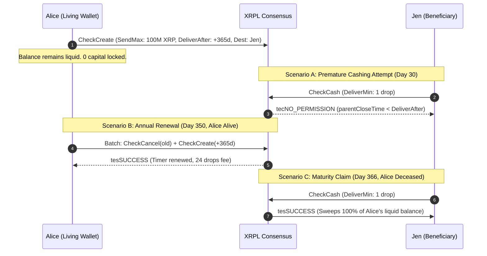

# XLS-XXd: Post-Dated Checks (`DeliverAfter` Execution Window for XRPL Checks)

```
Title:       Post-Dated Checks for Subscriptions, Deferred Settlement & Non-Custodial Estate Planning
Author:      Chris Thompson
Status:      Draft
Type:        Standards Track (Amendment)
Created:     2026-08-06
Updated:     2026-09-27
Amendment:   featurePostDatedChecks
```

---

## Abstract

This proposal introduces an optional `DeliverAfter` timestamp field to the existing `CheckCreate` transaction on the XRP Ledger. By enforcing an on-chain start time before which a check cannot be cashed, this amendment enables **Post-Dated Checks**. 

This amendment solves three major architectural challenges across the ecosystem:
1. **Lightweight Subscriptions & Deferred Settlement**: Provides a user-sovereign alternative to heavy recurring subscription proposals (such as [XLS-78](https://github.com/XRPLF/XRPL-Standards/tree/master/XLS-0078-subscriptions)) by reusing the battle-tested XRPL `Check` ledger engine (`ltCHECK`). Users can issue a series of post-dated checks in a single atomic batch transaction (up to the current XLS-56d protocol limit of **8 checks per batch**, or **12** if the batch limit is expanded by a future amendment) while retaining full unilateral cancellation rights via `CheckCancel`.
2. **Non-Custodial Estate Planning & Trustless Dead-Man Switches**: Provides a minimal, zero-bloat alternative to complex inheritance proposals (such as [XLS-91d](https://github.com/XRPLF/XRPL-Standards/pull/217) `SetBeneficiary`). By combining `DeliverAfter` with `CheckCash`'s native partial-delivery mechanic (`sfDeliverMin`), an account owner can configure an estate succession check that automatically sweeps liquid balances upon maturity without locking capital upfront in escrows or risking premature execution in multisig arrangements.
3. **Milestone Trust Funds, Milestone Vesting & Deferred Settlements**: Solves the fundamental constraint of `EscrowCreate` (100% capital lockup) by enabling milestone gifts (e.g., reaching age of majority), enterprise employee retention bonuses, and tax-deferred legal installments to remain 100% liquid and yield-earning in the payer's wallet until maturity, while preserving unilateral cancellation authority (`CheckCancel`).

---

## Motivation

### 1. The Problem with Complex Subscription Amendments (XLS-78)
Proposals like [XLS-78](https://github.com/XRPLF/XRPL-Standards/tree/master/XLS-0078-subscriptions) attempt to solve recurring payments by introducing an entire new subscription ledger engine (`ltSUBSCRIPTION`), along with custom claim loops, specialized period counters, and new transaction types (`SubscriptionCreate`, `SubscriptionClaim`, `SubscriptionCancel`). 

This approach adds significant protocol complexity, increases ledger state bloat, and forces validators to maintain complex state machines for a feature that can be achieved with existing primitives.

### 2. The Problem with Complex Inheritance Amendments (XLS-91d)
Proposals like [XLS-91d](https://github.com/XRPLF/XRPL-Standards/pull/217) (`SetBeneficiary`) attempt to solve estate succession and account recovery by introducing dedicated inheritance primitives, new transaction types, and on-chain inactivity tracking. This design introduces severe structural drawbacks:
* **Protocol Bloat & Attack Surface**: Modifies core account state (`AccountRoot`) or introduces new state objects to store `sfBeneficiary` and `sfTimeLock`, requiring specialized revocation flows and validation logic.
* **The Inactivity Heuristic Trap**: Defining "inactivity" or "death" on a decentralized ledger is notoriously unreliable. Automated airdrops, trustline distributions, or validator payouts can misclassify active users as deceased, while malicious actors can seek edge cases in sequence tracking to trigger early execution.
* **The Multi-Asset Sweep Problem**: Automatically reassigning or transferring all trustlines, token balances, and NFTs in a single inheritance transaction creates massive transactor complexity and introduces Denial-of-Service (DoS) vectors against validators.
* **Capital Lockup vs. Collusion**: Existing workarounds—such as locking funds into `Escrow` or using multi-sig thresholds (e.g. 2-of-3 with an executor)—either destroy capital liquidity while the owner is alive or expose the owner to premature theft through signer collusion.

### 3. The Problem with Escrow Capital Immobilization
Conditional payments on the XRPL currently rely on `EscrowCreate`. While effective for trustless counterparty atomic delivery, Escrow enforces rigid capital immobilization:
* **Total Illiquidity**: Once capital is committed to an escrow, the creator cannot deploy, trade, or access those funds under any circumstances until the escrow is either completed or cancelled after `CancelAfter`.
* **Zero Yield / Productive Utility**: Capital locked in escrow sits completely idle, unable to generate returns in Single-Asset Vaults or automated market maker (AMM) liquidity pools.
* **Lack of Unilateral Creator Cancellation**: If a parent sets up an escrow for their child's 18th or 21st birthday, the funds are untouchable for years—even if an catastrophic family medical emergency or financial bankruptcy occurs in the interim.

### 4. The Post-Dated Check Solution
The XRP Ledger already possesses a robust, secure `Check` primitive (`ltCHECK`). However, `CheckCreate` currently only supports an `Expiration` timestamp (the cutoff *after* which a check can no longer be cashed). It lacks a `DeliverAfter` timestamp (the start time *before* which a check cannot be cashed).

By adding `DeliverAfter` to `CheckCreate`:
1. **Zero New Ledger Object Types**: Reuses existing `ltCHECK` objects.
2. **User Sovereignty & Security**: The user maintains total custody. If a user wishes to cancel a subscription, update an estate plan, or revoke a milestone gift, they simply submit a `CheckCancel` transaction for remaining un-cashed checks.
3. **Active Capital Liquidity**: Payer funds remain 100% liquid and can generate yield across DeFi primitives (AMM, Vaults) right up until the check is cashed.
4. **Batching Efficiency**: Under current XRPL Batch rules (XLS-56d), a user can sign up to **8 post-dated checks in a single batch transaction** (e.g. 8 billing cycles). If the batch size limit is later amended to 12, full annual 12-month coverage is unlocked automatically.
5. **Natural Renewal Bounds**: Forcing a re-authorization boundary every 8 billing periods prevents forgotten "zombie" subscriptions from draining user funds indefinitely.
6. **Trustless Dead-Man & Milestone Execution**: A check post-dated for future delivery cannot be cashed by anyone (even the beneficiary) before maturity (`tecNO_PERMISSION`), while maintaining full unilateral cancellation rights for the issuer.

---

## Specification

### 1. Transaction Field Modification: `CheckCreate`

Add an optional `DeliverAfter` field to the `CheckCreate` transaction format.

| Field | JSON Type | Internal Type | Required? | Description |
| :--- | :--- | :--- | :--- | :--- |
| `DeliverAfter` | Number | `STUInt32` | Optional | Time in seconds since the Ripple Epoch after which this check becomes cashable. |

#### Field Constraints:
- If both `DeliverAfter` and `Expiration` are specified, validation MUST enforce `DeliverAfter < Expiration`. Otherwise, the transaction fails with `temBAD_EXPIRATION`.

---

### 2. Ledger Object Modification: `Check` (`ltCHECK`)

Update the `Check` ledger entry structure to store the optional `DeliverAfter` field.

| Field | JSON Type | Internal Type | Required? | Description |
| :--- | :--- | :--- | :--- | :--- |
| `DeliverAfter` | Number | `STUInt32` | Optional | The timestamp before which this check cannot be cashed. |

---

### 3. Execution & Validation Rules

#### `CheckCash` Validation Logic
When a payee submits a `CheckCash` transaction referencing a `Check` object:
1. If the `Check` contains a `DeliverAfter` field:
   - The engine checks the current parent ledger close time (`parent_close_time`).
   - If `parent_close_time < Check.DeliverAfter`, the transaction MUST fail with error code `tecNO_PERMISSION`.
2. If `parent_close_time >= Check.DeliverAfter`, the transaction proceeds to normal balance and trustline settlement.

---

### 4. Subscription & Dead-Man Cancellation & Reserve Recovery

When a user decides to cancel a subscription or update an estate plan, the cancellation mechanism relies on the existing `CheckCancel` primitive:

1. **Unilateral User Revocation**: The creator can submit `CheckCancel` for any or all un-cashed post-dated checks at any time. The payee/beneficiary cannot block or delay this action.
2. **Atomic Batch Cancellation**: Using a single atomic batch transaction (XLS-56d), a user can cancel all remaining post-dated checks (e.g., Checks 4 through 8) in 1 single wallet signature.
3. **Instant Reserve Refund**: Submitting `CheckCancel` immediately deletes the `ltCHECK` ledger objects and refunds 100% of the associated account owner reserves back to the creator.

---

## Application 1: Recurring Subscriptions

### Standard Workflow Example (8-Check Batch Example)

1. **Subscriber Initiates**: Subscriber wants an 8-period recurring subscription at 15 XRP / period.
2. **Single Batch Issuance**: The subscriber signs a single batch transaction containing 8 `CheckCreate` items (respecting the current 8-item batch limit):
   - Check 1: `DeliverAfter` = Day 0, `Expiration` = Day 30
   - Check 2: `DeliverAfter` = Day 30, `Expiration` = Day 60
   - Check 3: `DeliverAfter` = Day 60, `Expiration` = Day 90
   - ...
   - Check 8: `DeliverAfter` = Day 210, `Expiration` = Day 240
3. **Payee Cashing**: On Day 30, the merchant's automated worker submits `CheckCash` for Check 2. The ledger verifies `parent_close_time >= Day 30` and settles 15 XRP.
4. **Subscription Cancellation**: If the subscriber cancels after Month 2, their wallet app submits a single batch transaction containing `CheckCancel` for Checks 3 through 8. Future payments are revoked on-chain instantly, and all remaining reserves are refunded.

---

## Application 2: Non-Custodial Dead-Man Switch & Estate Succession

### The "Dynamic Balance Sweep" Mechanic (`DeliverMin`)
In traditional banking, writing a check for more than the account balance results in a bounce. On the XRP Ledger, `CheckCash` features built-in partial delivery semantics via **`sfDeliverMin`**:

$$\text{xrpDeliver} = \min(\text{sendMax}, \text{srcLiquid})$$

Where `srcLiquid` is the sender's account balance minus reserve requirements at the exact time of cashing.

By creating a check with a high `SendMax` (e.g. $100,000,000\text{ XRP}$) and having the beneficiary cash it with `DeliverMin: 1 drop`, **the check never bounces**. It automatically sweeps 100% of whatever liquid balance remains in the wallet at maturity.



### The Trustless 2-of-2 Hybrid Legal Vault
For users desiring an extra layer of fiduciary separation:
1. **Estate Account (`W_estate`)**:
   - Master key disabled (`asfDisableMasterKey`).
   - `SignerListSet` configured with **Quorum = 2**:
     - `Signer_A` (Weight 1): Seed A deposited in a sealed testamentary envelope with an estate attorney (released only upon verified death certificate).
     - `Signer_B` (Weight 1): Seed B held directly by the spouse/beneficiary.
2. **Funding**: Alice writes a post-dated check with `DeliverAfter: +1 Year` to `W_estate`.
3. **Zero Financial Exposure to Third-Party Disasters**:
   - If the lawyer's office burns down, the lawyer dies, or the firm dissolves: **Alice loses $0**.
   - Alice simply submits `CheckCancel` from her living wallet, generates new seeds for a new firm, and issues a fresh check.

### Fail-Safe Mechanics: What Happens if a User Misses Their Renewal?

A common failure mode in smart contract dead-man switches is automatic liquidation: if an owner is hospitalized or on vacation and misses a timer, their funds are irreversibly liquidated. 

Post-Dated Checks eliminate this hazard entirely through pull-based semantics:
1. **No Automatic Push**: The ledger does not automatically execute or move funds upon reaching `DeliverAfter`. It merely unlocks cashing permission.
2. **Exclusive Beneficiary Authority**: Only the designated beneficiary (`sfDestination`) possesses the cryptographic authorization to submit `CheckCash`. No third-party bots, MEV searchers, or validators can claim or drain the funds.
3. **Information Asymmetry**: If the owner is still alive and simply missed their renewal date, the beneficiary is typically not actively monitoring the mempool or expecting an execution.
4. **Perpetual Unilateral Recall**: As long as the check has not been cashed, the living owner retains 100% unilateral authority to submit `CheckCancel` at Day 370, Day 400, or any later date. The owner can cancel the matured check or roll it forward into a new one at any time with a single 10-drop transaction.

---

## Application 3: Milestone Trust Funds, Milestone Vesting & Deferred Settlements

While `EscrowCreate` exists on the XRP Ledger for conditional value transfers, Escrow enforces an immutable constraint: **100% capital immobilization**. Once funds are locked in Escrow, the creator cannot deploy, trade, or access that capital under any circumstances until `CancelAfter` (if configured) or condition fulfillment. Furthermore, Escrow lacks unilateral creator cancellation authority prior to maturity.

`CheckCreate` with `DeliverAfter` introduces a complementary economic primitive: **deferred settlement with active capital liquidity and unilateral creator cancellation**.

### 1. Milestone Trust Funds & Age-of-Majority Transfers
- **Use Case**: A parent wishes to transfer capital (e.g., 25,000 RLUSD or XRP) to their child upon reaching adulthood (e.g., 18th or 21st birthday) or graduation.
- **The Capital Trap with Escrow**: If placed in Escrow with a multi-year lockup, the parent completely loses access to those funds. If a severe family medical emergency, legal expense, or sudden financial catastrophe strikes during that window, the parent cannot access their own capital.
- **The Post-Dated Check Model**:
  - The parent issues a check with `DeliverAfter: <18th_Birthday_Timestamp>`.
  - The capital remains 100% unencumbered in the parent's wallet, continuing to earn AMM liquidity yields, Single-Asset Vault interest, or serving as an active emergency cushion.
  - **Unilateral Cancellation / Voiding Authority**: If the family encounters financial distress, or if circumstances change prior to maturity, the parent submits `CheckCancel` at any time to immediately void the check and release the owner reserve.
  - Upon reaching maturity, the adult child simply submits `CheckCash` to claim the gift.

### 2. Milestone Vesting & Employee Retention
- **Use Case**: An enterprise issues retention bonuses or performance tranches maturing annually across a multi-year employment agreement.
- **The Problem with Escrow**: Escrow forces the company to tie up working capital years in advance in rigid vaults. Revoking unvested tranches requires complex multisig, oracle arbitration, or mutual consent.
- **The Post-Dated Check Model**:
  - The corporate treasury signs post-dated checks maturing at Month 12, Month 24, and Month 36.
  - The treasury retains full operational custody and treasury yield on its working capital.
  - **Separation Voiding Authority**: If the employee voluntarily resigns, is terminated for cause, or breaches covenants prior to a milestone, the company invokes `CheckCancel` to void un-matured checks on-chain.
  - If the employee remains in good standing, each tranche becomes cashable on its exact maturity date.

### 3. Structured Legal Settlements & Fiscal Tax Installments
- **Use Case**: Commercial contract disputes, divorce decrees, or buyout agreements requiring installment payments structured across separate fiscal tax years (e.g., January 2 of consecutive calendar years) to avoid lump-sum tax realization.
- **The Post-Dated Check Model**:
  - Payer writes post-dated checks maturing on the first business day of future tax years.
  - The recipient is cryptographically prevented from pulling funds prematurely into the current tax year (`parentCloseTime < DeliverAfter` enforces `tecNO_PERMISSION`).
  - Ensures strict adherence to statutory payment timing without requiring an expensive legal escrow agent or escrow service fees.

### Comparative Architectural Analysis: Capital Immobilization vs. Liquid Deferral

| Dimension | `EscrowCreate` | `CheckCreate` with `DeliverAfter` |
| :--- | :--- | :--- |
| **Capital State** | Fully locked and immobilized on-ledger | Fully sovereign, unencumbered, and liquid |
| **Productive Yield** | 0% (Capital sits idle in escrow ledger object) | Retains 100% ability to earn AMM or Vault yields |
| **Creator Cancellation** | Impossible prior to `CancelAfter` timestamp | Unilateral cancellation (`CheckCancel`) at any time |
| **Counterparty Assurance** | Guaranteed collateral (pre-funded) | Balance availability at cashing (settlement risk) |
| **Primary Optimal Fit** | Trustless counterparty trades & atomic swaps | Milestone gifts, employee retention, structured settlements |

---

## Reference xApp Architecture: Zero-Cost Static Dead-Man Client

To maximize accessibility, this standard can be supported by an open-source, zero-backend xApp ("EstateX / XRPL Heirloom"):

### 1. Zero-Cost, Serverless Architecture
- **Permanent Free Hosting**: Statically compiled HTML/TypeScript hosted indefinitely on **GitHub Pages** or **Cloudflare Pages** ($0 cost, 100% global uptime, zero server maintenance).
- **100% Non-Custodial**: No private keys ever touch the application. All signing operations route securely via standard Xaman (Xumm) SDK or WalletConnect deep links.
- **Local Storage**: Stores tracking metadata (`CheckID`, beneficiary address, maturity timestamp) in encrypted local browser storage.

### 2. The 3-Question Onboarding Wizard
1. **"Who is your beneficiary?"**: Enter beneficiary `r-address` (or a 2-of-2 estate vault).
2. **"What would you like to pass on?"**: Default: **"100% of Liquid Balance"** (App sets `SendMax: 100,000,000 XRP` + `DeliverMin: 1 drop` for dynamic sweeping, or specific IOU/RLUSD tokens).
3. **"Set renewal cadence"**: Default: **365 Days** (1 Year).

**Action**: User taps **"Activate Protection"**. The xApp generates `CheckCreate` with `DeliverAfter: now + 365 days` and prompts the user for 1 biometric signature in Xaman.

### 3. Frictionless Renewal Reminders (Opt-In)
Because the app has no backend database, users can opt into two native, zero-infrastructure reminder channels:
- **1-Click Calendar Sync (`.ics` / Google / Apple Calendar)**: Adds an annual reminder to the user's phone, laptop, and Apple Watch for **Day 350** (15 days prior) and **Day 358** (7 days prior), completely independent of web browsers or servers.
- **Xaman Mobile Push Notifications**: Subscribes the user to direct push notifications via Xaman's native notification dispatch.

### 4. The 1-Tap Annual Renewal (XLS-56d Atomic Batch)
When the reminder appears on Day 358:
- Prompt: *"Your Dead-Man Check matures in 7 days. Are you alive and well? Do you want to renew with [rBeneficiary]?"*
- User taps **"Renew for 1 Year"**.
- The xApp crafts a single **XLS-56d Atomic Batch Transaction** containing:
  1. `CheckCancel` (cancels expiring check, **immediately releasing the owner reserve**).
  2. `CheckCreate` (creates new check for next 365 days, **reusing the refunded reserve**).
- **User Action**: Exactly **1 biometric confirmation** in Xaman.
- **Net Cost**: ~20 drops ($0.00001). **Zero net change in account reserve**.

### 5. Beneficiary Claim Portal ("Heir Claim")
1. Beneficiary opens the xApp and connects their Xaman wallet.
2. The app scans the ledger for checks where `Destination == Beneficiary` and verifies `parentCloseTime >= DeliverAfter`.
3. If mature, the app displays: *"Estate Check Ready: [Amount] XRP Available"*.
4. Beneficiary taps **"Claim Estate"**, submitting `CheckCash` with `DeliverMin: 1 drop`.
5. The ledger dynamically sweeps 100% of the liquid balance into the beneficiary's wallet in ~3.5 seconds.

### 6. Synergy with XLS-75 (Delegated Cashing & Proof-of-Burn)
1. **Third-Party Executor Cashing**: Under XLS-75, a beneficiary can execute `DelegateSet` granting `ttCHECK_CASH` to an executor. The executor submits `CheckCash` on behalf of the beneficiary (`sfDelegate: rExecutor`), and funds transfer directly into the beneficiary's wallet without the executor ever holding custody.
2. **Delegated Blackhole Settlement (Proof-of-Burn)**: An account (`rBlackhole`) can execute `DelegateSet` granting `ttCHECK_CASH` to an external watcher, then permanently disable its master key (`asfDisableMasterKey`). If a post-dated check targeting `rBlackhole` reaches maturity, the watcher submits `CheckCash` on behalf of `rBlackhole`, sweeping and permanently burning the liquid balance without needing private key access.

---

## Comparison With Alternative Proposals

### Comparison 1: Subscriptions (XLS-78 vs. XLS-XXd)

| Feature | XLS-78 Subscriptions | XLS-XXd Post-Dated Checks |
| :--- | :--- | :--- |
| **New Ledger Object** | Requires new `ltSUBSCRIPTION` object | **Zero** new objects (uses `ltCHECK`) |
| **Protocol Footprint** | Large (4 new transaction types) | **Minimal** (1 field added to `CheckCreate`) |
| **User Control** | Complex cancellation / pause states | **Instant** `CheckCancel` batch revocation |
| **Merchant Risk** | Subject to balance failure at claim | Identified immediately upon cashing attempt |
| **Re-Authorization Boundary** | Can run indefinitely | Enforces explicit 8-check user review (or 12 if batch size amended) |

### Comparison 2: Inheritance & Estate Planning (XLS-91d vs. XLS-XXd)

| Metric / Scenario | XLS-91d (`SetBeneficiary`) | XLS-XXd Post-Dated Checks (`DeliverAfter`) |
| :--- | :--- | :--- |
| **New Transaction Types** | $\ge 1$ (`SetBeneficiary`) | **Zero** (re-uses `CheckCreate`, `CheckCash`, `CheckCancel`) |
| **Ledger Object Bloat** | Modifies `AccountRoot` or creates new entry | **Zero** (stores optional field in `ltCHECK`) |
| **Engine Code Impact** | High (inactivity tracking, new claim handlers) | **~37 lines of C++** in `xrpld` |
| **Fund Sweeping Mechanism** | Unspecified / complex multi-trustline loops | **Native** via `DeliverMin: 1 drop` in `CheckCash` |
| **Premature Execution Risk** | High if sequence tracking is gamed | **Zero** (strictly enforced by `parent_close_time`) |
| **Liquidity While Living** | Uncertain / frozen status states | **100% Liquid**; user spends freely every day |
| **Third-Party Custodial Risk**| Dependent on external attestation/notary | **Zero**; full unilateral cancellation via `CheckCancel` |

---

## Reference Implementation (`xrpld` Code Diff)

A complete, production-ready reference implementation tested against `xrpld 3.5.0-b0` (passing all 2,511 unit test assertions with 0 failures) is published on GitHub at [`bigcjat/rippled@feature/post-dated-checks`](https://github.com/bigcjat/rippled/tree/feature/post-dated-checks).

The entire proposal is implemented across 6 existing files in `xrpld` with zero new object types or transactors:

### 1. Register Feature Flag
`include/xrpl/protocol/detail/features.macro`:
```diff
+XRPL_FEATURE(PostDatedChecks,             Supported::Yes, VoteBehavior::DefaultNo)
```

### 2. Define Serialized SField
`include/xrpl/protocol/detail/sfields.macro`:
```diff
+// 32-bit integers
+TYPED_SFIELD(sfDeliverAfter,             UINT32,    86)
```

### 3. Register Optional Field in `CheckCreate`
`include/xrpl/protocol/detail/transactions.macro`:
```diff
 TRANSACTION(ttCHECK_CREATE, 16, CheckCreate, ({.delegable = Delegation::Delegable}), ({
     {sfDestination, SoeRequired},
     {sfSendMax, SoeRequired, SoeMptSupported},
     {sfExpiration, SoeOptional},
     {sfDestinationTag, SoeOptional},
     {sfInvoiceID, SoeOptional},
+    {sfDeliverAfter, SoeOptional},
 }))
```

### 4. Register Optional Field in `ltCHECK` Ledger Object
`include/xrpl/protocol/detail/ledger_entries.macro`:
```diff
 LEDGER_ENTRY(ltCHECK, 0x0043, Check, check, ({
     {sfAccount,              SoeRequired},
     {sfDestination,          SoeRequired},
     {sfSendMax,              SoeRequired},
     {sfSequence,             SoeRequired},
     {sfOwnerNode,            SoeRequired},
     {sfDestinationNode,      SoeRequired},
     {sfExpiration,           SoeOptional},
+    {sfDeliverAfter,         SoeOptional},
     {sfInvoiceID,            SoeOptional},
     {sfSourceTag,            SoeOptional},
     {sfDestinationTag,       SoeOptional},
     {sfPreviousTxnID,        SoeRequired},
     {sfPreviousTxnLgrSeq,    SoeRequired},
 }))
```

### 5. Enforce Ordering in `CheckCreate` Transactor
`src/libxrpl/tx/transactors/check/CheckCreate.cpp`:

In `CheckCreate::preflight`:
```diff
+    auto const optDeliverAfter = ctx.tx[~sfDeliverAfter];
+    if (optDeliverAfter)
+    {
+        if (!ctx.rules.enabled(featurePostDatedChecks))
+            return temDISABLED;
+
+        if (*optDeliverAfter == 0)
+        {
+            JLOG(ctx.j.warn()) << "Malformed transaction: bad deliver after";
+            return temBAD_EXPIRATION;
+        }
+    }
+
     if (auto const optExpiry = ctx.tx[~sfExpiration])
     {
         if (*optExpiry == 0)
         {
             JLOG(ctx.j.warn()) << "Malformed transaction: bad expiration";
             return temBAD_EXPIRATION;
         }
+
+        if (optDeliverAfter && *optExpiry <= *optDeliverAfter)
+        {
+            JLOG(ctx.j.warn()) << "Malformed transaction: expiration must be after deliver after";
+            return temBAD_EXPIRATION;
+        }
     }
```

In `CheckCreate::doApply`:
```diff
     if (auto const expiry = ctx_.tx[~sfExpiration])
         sleCheck->setFieldU32(sfExpiration, *expiry);
+    if (auto const deliverAfter = ctx_.tx[~sfDeliverAfter])
+        sleCheck->setFieldU32(sfDeliverAfter, *deliverAfter);
```

### 6. Enforce Maturity Gate in `CheckCash` Transactor
`src/libxrpl/tx/transactors/check/CheckCash.cpp`:

In `CheckCash::preclaim`:
```diff
     if (hasExpired(ctx.view, sleCheck->at(~sfExpiration)))
     {
         JLOG(ctx.j.warn()) << "Cashing a check that has already expired.";
         return tecEXPIRED;
     }
+
+    if (ctx.view.rules().enabled(featurePostDatedChecks))
+    {
+        if (auto const deliverAfter = sleCheck->at(~sfDeliverAfter))
+        {
+            if (!after(ctx.view.parentCloseTime(), *deliverAfter))
+            {
+                JLOG(ctx.j.warn()) << "Cashing a check before deliver after time.";
+                return tecNO_PERMISSION;
+            }
+        }
+    }
```

### 7. Existing Native Cancellation (`CheckCancel.cpp`)
Zero modifications required. `CheckCancel.cpp` lines 41–46 already grant both the check creator (`Account`) and recipient (`Destination`) unilateral cancellation authority at any time prior to expiration. Submitting `CheckCancel` immediately deletes the `ltCHECK` object and refunds 100% of the owner reserve.

### 8. Unit Test Suite (`Check_test.cpp`)
Implemented under `src/test/app/Check_test.cpp` via `testPostDatedChecks(features)` with helper `DeliverAfter` in `src/test/jtx/TestHelpers.h`. Passes all 15 cases (2,511 test assertions) with 0 failures:
- Disabled feature rejection (`temDISABLED`)
- Zero timestamp rejection (`temBAD_EXPIRATION`)
- Inverted boundary validation `DeliverAfter >= Expiration` (`temBAD_EXPIRATION`)
- Premature cashing prevention (`tecNO_PERMISSION`)
- Post-maturity cashing success (`tesSUCCESS`)
- Dynamic balance sweep (`DeliverMin: 1 drop`)
- Issuer unilateral cancellation (`CheckCancel`) before maturity

---

## Backwards Compatibility

This amendment is fully backwards compatible:
- Existing `CheckCreate` transactions without `DeliverAfter` continue to function identically.
- Clients and wallets that do not support `DeliverAfter` simply ignore the field.
- Amendments required: `featurePostDatedChecks`.

---

## Security Considerations

1. **Deterministic Time Sync**: Uses the immutable `parent_close_time` of validated ledgers to ensure deterministic evaluation across all validators via the native `after()` consensus helper.
2. **No Reserve Exhaustion**: Checks consume standard `ltCHECK` owner reserves, which are fully refunded upon cashing or cancellation.
3. **Replay Protection**: Each check possesses a unique, immutable `CheckID` generated at creation time, preventing replay attacks.
4. **Zero-Lockup Sovereignty**: Because checks do not lock funds, user funds remain fully sovereign and unencumbered until the exact moment of cashing.

